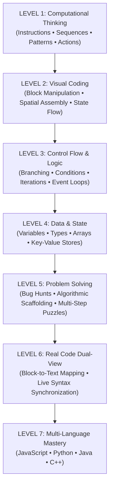
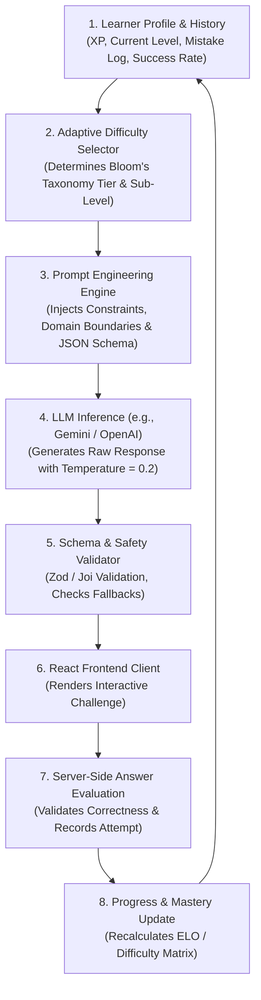
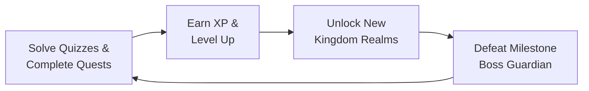
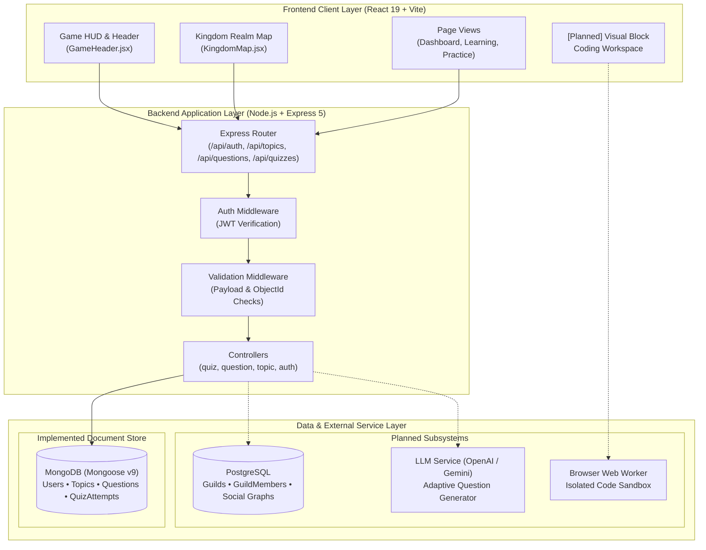
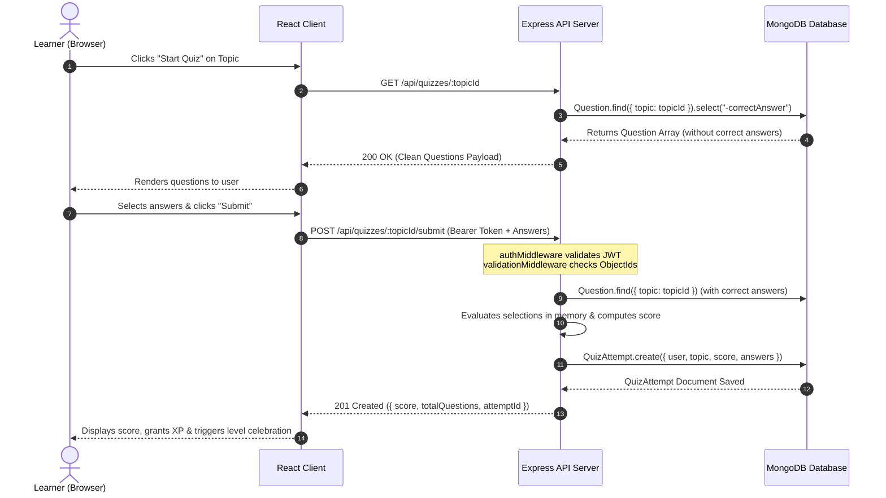
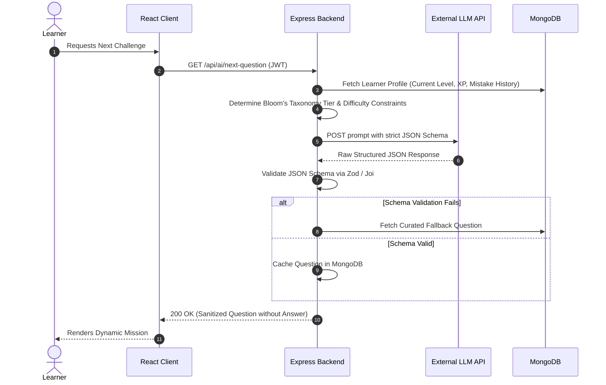
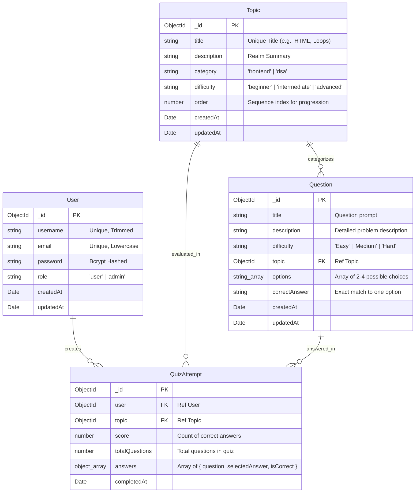
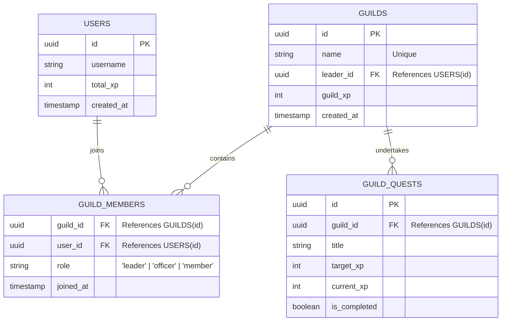
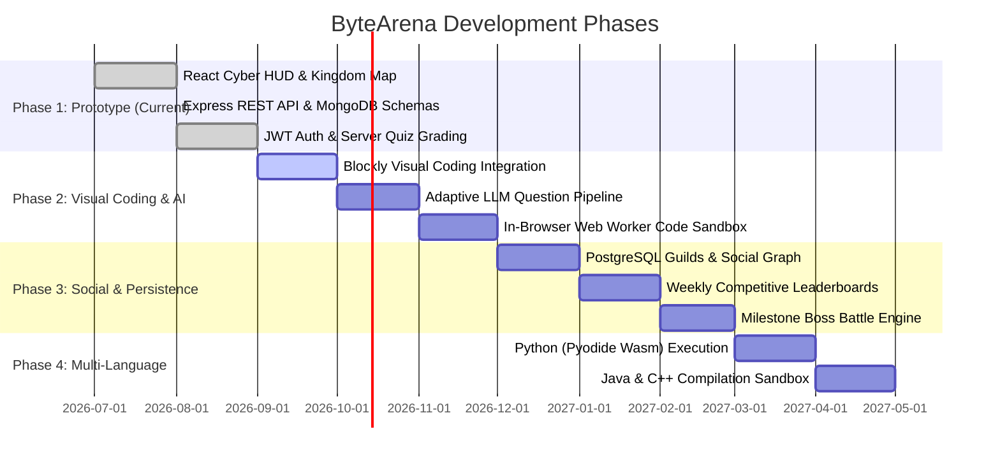

# 🚀 ByteArena (CodeVerse)

> **"Learn coding by playing, building, solving, and gradually writing real code."**  
> An adaptive, gamified programming-learning platform designed to take young learners and beginners from foundational computational thinking to real-world code through interactive game mechanics.

---

[](https://nodejs.org/)
[](https://expressjs.com/)
[](https://react.dev/)
[](https://vitejs.dev/)
[](https://mongoosejs.com/)
[](https://jwt.io/)
[](#-system-architecture)
[](LICENSE)

---

## 📖 Table of Contents

- [🎮 What Is This?](#-what-is-this)
- [🎯 The Problem](#-the-problem)
- [💡 Vision \& Core Philosophy](#-vision--core-philosophy)
- [👨‍🎓 Target Users](#-target-users)
- [🗺️ Core Learning Journey](#-core-learning-journey)
- [🤖 AI-Powered Adaptive Learning](#-ai-powered-adaptive-learning)
- [📈 Gradual Difficulty Progression](#-gradual-difficulty-progression)
- [🎮 Gamification Engine](#-gamification-engine)
- [🧩 Block-Based Visual Coding](#-block-based-visual-coding)
- [✨ Implemented \& Planned Features](#-implemented--planned-features)
- [🏗️ System Architecture](#-system-architecture)
- [🔄 Data Flow](#-data-flow)
- [🤖 AI Application Architecture](#-ai-application-architecture)
- [🗄️ Database Design](#-database-design)
- [🔌 API Design \& Endpoints](#-api-design--endpoints)
- [📁 File \& Folder Architecture](#-file--folder-architecture)
- [🛠️ Tech Stack](#-tech-stack)
- [⚙️ Getting Started \& Setup](#-getting-started--setup)
- [🔐 Environment Variables](#-environment-variables)
- [🧪 Testing Strategy](#-testing-strategy)
- [⚠️ Error Handling](#️-error-handling)
- [🔒 Security Practices](#-security-practices)
- [📚 Engineering Concepts Demonstrated](#-engineering-concepts-demonstrated)
- [⚡ Deep JavaScript Concepts](#-deep-javascript-concepts)
- [🎨 Design System](#-design-system)
- [🧠 UX Principles](#-ux-principles)
- [🚶 Example User Journey](#-example-user-journey)
- [🎓 Project Viva Preparation](#-project-viva-preparation)
- [🗺️ Product Roadmap](#-product-roadmap)
- [🤝 Contributing](#-contributing)
- [📄 License](#-license)
- [🌟 Final Vision](#-final-vision)

---

## 🎮 What Is This?

**ByteArena** (also titled **CodeVerse**) is an adaptive, gamified programming education platform that transforms coding from an abstract, syntax-heavy academic subject into an adventure-driven video game.

Instead of staring at a blank terminal or memorizing cryptic syntax errors, learners embark on missions across progressive "Kingdoms" (such as the *Structure Realm* of HTML, the *Style Realm* of CSS, and the *Logic Realm* of JavaScript). Players complete micro-quests, solve logic puzzles, earn Experience Points (XP), conquer milestone "Boss Battles," and advance from visual block-based algorithmic manipulation to writing real-world code in multiple programming languages.

The application combines a high-performance **React 19 + Vite** single-page frontend styled with a dark futuristic cyber aesthetic, coupled with a modular **Node.js + Express 5** RESTful backend supported by **MongoDB / Mongoose** for persistent curriculum, question banks, user authentication, and quiz evaluation.

---

## 🎯 The Problem

### The Syntax Barrier in Early Programming Education

Traditional computer science instruction introduces young students and absolute beginners to syntax before they grasp underlying computational logic. When a 9- or 10-year-old (approximately 4th grade) is exposed to constructs like:

```python
for i in range(len(arr)):
    if arr[i] % 2 == 0:
        continue
```

they are forced to juggle:
1. **Punctuation rules:** Colons, brackets, parentheses, semicolons, and whitespace indentation.
2. **Abstract lexical tokens:** `for`, `in`, `range`, `len`, `continue`.
3. **Underlying concepts:** Sequencing, iteration, conditionals, index tracking, arrays, and remainder arithmetic.

Any misplaced character results in an intimidating, cryptic error message (`SyntaxError: unexpected EOF while parsing`). The learner spends 90% of their cognitive bandwidth debugging syntax instead of developing algorithmic thinking.

### The Educational Paradigm Shift

| Traditional Learning Loop | ByteArena Gamified Learning Loop |
|:---|:---|
| 📖 **Read** textbook or watch lecture | 🎮 **Play** interactive level with tangible mission goals |
| 🧠 **Memorize** grammar and keywords | 🧪 **Experiment** with visual actions and spatial mechanics |
| ⌨️ **Write Code** in empty text editor | 🧩 **Build Blocks** to formulate sequencing and logic |
| ❌ **Debug** syntax errors and crashes | ⚡ **Run & See** immediate graphical results (e.g., character moves) |
| 😓 **Feel Frustrated** and disengage | 💡 **Understand** core principle, unlock next realm, level up |
| ⏳ **Delayed Mastery** | 🚀 **Write Real Code** after mental model is firmly established |

---

## 💡 Vision & Core Philosophy

The foundational philosophy of ByteArena is:

$$\Large \mathbf{PLAY} \longrightarrow \mathbf{BUILD} \longrightarrow \mathbf{UNDERSTAND} \longrightarrow \mathbf{CODE} \longrightarrow \mathbf{MASTER}$$

Learners do not start by memorizing language syntax. Instead, they first master:
- **Sequencing:** Order of operations, step-by-step execution.
- **Pattern Recognition:** Identifying repeated structures.
- **Conditions:** Making decisions based on state (`if/else`).
- **Loops:** Repeating actions until an exit condition is met (`iteration`).
- **Variables & Values:** Storing, reading, and mutating data.
- **Functions:** Packaging instructions into reusable modules.
- **Problem Decomposition:** Breaking large challenges into conquerable sub-problems.
- **Computational Thinking:** Formulating algorithmic solutions independent of syntax.

Once the conceptual mental model is established, the platform systematically bridges visual block abstractions to syntax in production languages (**JavaScript**, **Python**, **Java**, and **C++**).

---

## 👨‍🎓 Target Users

### Primary Users
- **Elementary & Middle-School Learners (Ages 9–12 / ~4th Grade+):** Absolute beginners with no prior coding experience who need an approachable, visual, gamified mental model.
- **Novice Programmers:** Anyone who finds command-line interfaces or traditional textbooks intimidating.
- **Visual & Kinaesthetic Learners:** Students who learn best by dragging, snapping, testing, and observing instant feedback.

### Secondary Users
- **Transitioning Students:** Learners who have outgrown pure drag-and-drop tools (e.g., Scratch) and want to understand how blocks map to real JavaScript or Python code.
- **Foundation Seekers & College Freshmen:** Students beginning introductory computer science courses who need clarity on core algorithms, data structures, and mental execution flow.

> **Cognitive Accessibility:** The UI is intentionally engineered with high-contrast cyber visuals, clear typography, large interactive cards, minimal clutter, and zero punishment for failure to reduce cognitive overload and encourage fearless experimentation.

---

## 🗺️ Core Learning Journey

ByteArena structures learner advancement across 7 progressive tiers:



- **LEVEL 1 — Computational Thinking:** Understand that computers execute exact sequential instructions. The learner commands a robot or avatar through discrete actions (`MoveForward()`, `TurnLeft()`).
- **LEVEL 2 — Visual Coding:** Build programs by snapping visual blocks together. Eliminates syntax errors entirely; invalid connections simply do not snap.
- **LEVEL 3 — Logic & Decisions:** Introduce decision points (`if obstacle Ahead then Jump else Walk`) and loops (`repeat 5 times`).
- **LEVEL 4 — Data & State:** Introduce containers for data (variables, inventory slots, score counters, arrays).
- **LEVEL 5 — Problem Solving:** Solve challenges with constraints: "Reach the goal using no more than 3 blocks," or "Find and fix the infinite loop in this pre-built sequence."
- **LEVEL 6 — Real Code:** A side-by-side view where dragging a visual block immediately generates and highlights the equivalent JavaScript or Python code snippet.
- **LEVEL 7 — Programming Languages (Planned Expansion):** Full text-based execution environments spanning Python, JavaScript, Java, and C++.

---

## 🤖 AI-Powered Adaptive Learning

One of the foundational architectural pillars of ByteArena is its **Dynamic AI Question Generation Engine**. Rather than relying solely on static question banks, ByteArena leverages an adaptive Large Language Model (LLM) pipeline that synthesizes custom, level-calibrated programming challenges based on individual learner history.

### The Question Generation Pipeline



### Factors Considered by the Adaptive Engine
1. **Current Level & Sub-tier:** Ensures questions never exceed the learner's unlocked syllabus.
2. **Concept Mastery Matrix:** Tracks topic proficiency (e.g., `loops: 85%`, `conditionals: 40%`).
3. **Error History:** Inspects specific recurring pitfalls (e.g., off-by-one errors, infinite loops).
4. **Recent Attempt Velocity:** Measures response time and retry frequency.
5. **Age-Appropriate Lexicon:** Filters out academic jargon in favor of playful, intuitive vocabulary suitable for a 4th grader.

---

## 📈 Gradual Difficulty Progression

ByteArena rejects naive binary difficulty scaling (where every correct answer immediately escalates difficulty). Instead, the system uses **in-domain scaffolding** and granular sub-levels.

```text
[BEGINNER] ──► Recognition ──► Simple Construction ──► Application ──► Debugging ──► Optimization [ADVANCED]
```

### Concrete Progression Example: Mastering Loops

| Sub-Level | Cognitive Task | Example Challenge |
|:---|:---|:---|
| **Level 2A (Recognition)** | Identify purpose of block | *"Look at this loop block. How many times will the star sparkle?"* |
| **Level 2B (Construction)** | Direct assembly | *"Snap a loop block to make the astronaut take exactly 5 steps forward."* |
| **Level 2C (Scaffolding)** | Constraint handling | *"Collect all 4 gems along the path using only ONE move block inside a loop."* |
| **Level 2D (Conditionals inside Loops)** | Compound logic | *"Repeat until you reach the spaceship: If path clear, move; if rock, jump."* |
| **Level 3 (Debugging)** | Spot the flaw | *"The robot ran past the battery and fell off the platform! Fix the count in this loop."* |
| **Level 4 (Code Equivalence)** | Visual to text | *"Which JavaScript `for` loop produces the exact same movement as your 5-step block?"* |

---

## 🎮 Gamification Engine

Gamification in ByteArena is not a superficial layer of random rewards—it is an intrinsic motivational engine designed to reinforce learning milestones, celebrate persistence, and make abstract progress visually concrete.



### Gamification Mechanics Breakdown

| Mechanic | Status | Implemented Details / Architectural Plan |
|:---|:---:|:---|
| **Kingdom Realm Map** | ✅ Implemented | Visual roadmap of progressive realms (`HTML Structure Realm`, `CSS Style Realm`, `JavaScript Logic Realm`) with active, locked, and boss states (`KingdomMap.jsx`). |
| **XP & Level HUD** | ✅ Implemented | Cyberpunk game header displaying Level (`LV 07`), live XP meter (`720 / 1000 XP`), and player avatar badge (`GameHeader.jsx`). |
| **Quiz Scoring & Attempts** | ✅ Implemented | Backend records total score, evaluated answers, and stores `QuizAttempt` documents linked to authenticated users (`QuizAttempt.js`). |
| **Milestone Boss Battles** | 🚧 Architecture Designed | End-of-realm assessments (e.g., "The Code Guardian") requiring 80%+ mastery to unlock subsequent realms. |
| **Daily & Milestone Quests** | 🚧 Architecture Designed | Time-bound and topic-bound missions granting bonus XP and unlockable badges. |
| **Streak Tracking** | 📋 Planned | Daily login and challenge-solving streak counters to incentivize consistent practice. |
| **Competitive Guilds & Leaderboards** | 📋 Planned | Relational schema planned in PostgreSQL for weekly cohort rankings and collaborative guild quests. |

---

## 🧩 Block-Based Visual Coding

To eliminate syntactic cognitive overhead, the platform is architected around an interactive visual block engine (inspired by **Blockly** and visual AST generators):

1. **Snap-Together Geometry:** Blocks only connect when logic types match (e.g., a boolean condition block cannot be slotted into an integer loop counter).
2. **Category Palettes:** Color-coded block categories (Movement, Loops, Logic, Variables, Functions, Display).
3. **Live AST (Abstract Syntax Tree) Generation:** The visual configuration parses directly into an in-memory syntax tree.
4. **Code Generation Pipeline:**
   $$\text{Visual Blocks} \xrightarrow{\text{AST}} \text{Target Code (JavaScript / Python)} \xrightarrow{\text{Sandbox}} \text{Safe Execution}$$
5. **Immediate Graphical Feedback:** Executing the blocks moves an on-screen avatar or updates an interactive canvas in real time.

---

## ✨ Implemented & Planned Features

### Current Feature Matrix

| Feature Area | Status | Component / Location | Description |
|:---|:---:|:---|:---|
| **Vite + React UI Engine** | ✅ Implemented | `frontend/src/App.jsx`, `main.jsx` | Fast, reactive SPA using React 19 and modern Vite tooling |
| **Dark Futuristic Cyber HUD** | ✅ Implemented | `frontend/src/components/layout/GameHeader.jsx` | Neon navigation bar, brand icon, level badge, XP progress meter, avatar |
| **Interactive Kingdom Map** | ✅ Implemented | `frontend/src/components/kingdom/KingdomMap.jsx` | Realm progression path with active/locked states and Boss Guardian node |
| **Express REST API Server** | ✅ Implemented | `backend/src/server.js`, `app.js` | Express 5 application with CORS, JSON body parser, and modular routing |
| **MongoDB / Mongoose Database** | ✅ Implemented | `backend/src/config/db.js`, `models/` | Mongoose 9 schemas for Users, Topics, Questions, and QuizAttempts |
| **User Authentication (JWT + bcrypt)** | ✅ Implemented | `backend/src/routes/auth.routes.js` | User registration with bcrypt hashing (salt=10), login with signed JWTs (1d expiry) |
| **Protected Route Middleware** | ✅ Implemented | `backend/src/middleware/authMiddleware.js` | Authorization header `Bearer <token>` verification for secure routes |
| **Curriculum Topics API** | ✅ Implemented | `backend/src/routes/topic.routes.js` | Endpoints to fetch all topics, filter by category (`frontend`, `dsa`), or get by ID |
| **Question Bank & Seeding API** | ✅ Implemented | `backend/src/routes/question.routes.js`, `seed/` | Endpoints to create/fetch questions; database seeders for 8 topics and 8 questions |
| **Quiz Execution & Submission Engine** | ✅ Implemented | `backend/src/routes/quiz.routes.js`, `controllers/` | Hides correct answers on quiz start (`.select("-correctAnswer")`); grades answers on server |
| **Request Validation Middleware** | ✅ Implemented | `backend/src/middleware/validationMiddleware.js` | Validates ObjectIds, enum values, options array bounds, and quiz submission structures |
| **Client-Side Routing** | 🚧 Partially Implemented | Navigation stubs in `GameHeader.jsx` | Route folder structure initialized (`pages/Dashboard`, `Practice`, `Boss`, etc.); `react-router-dom` planned |
| **Frontend-Backend API Integration** | 🚧 Partially Implemented | Backend endpoints ready; frontend hooks | Frontend currently renders mock kingdom data; React state hooks for API fetching planned |
| **AI Question Generation Service** | 📋 Planned Architecture | Designed in `docs/HLD.md` & `LLD.md` | LLM prompt pipeline with structured JSON schema output |
| **PostgreSQL Relational Layer** | 📋 Planned Architecture | Designed in `docs/HLD.md` | Relational tables for Guilds and complex user social graphs using SQL JOINs |
| **Blockly Visual Programming Engine** | 📋 Planned Architecture | Visual workspace specifications | Canvas-based drag-and-drop workspace generating JavaScript & Python code |
| **Sandboxed Code Runner (Pyodide / Worker)** | 📋 Planned Architecture | Execution layer | In-browser Web Worker sandbox for executing code safely without server risk |

---

## 🏗️ System Architecture

ByteArena is structured as a decoupled, multi-tier client-server architecture:



---

## 🔄 Data Flow

### 1. Implemented Quiz Lifecycle (Deterministic Server-Side Evaluation)



### 2. Planned AI-Generated Adaptive Question Flow



---

## 🤖 AI Application Architecture

### Planned Structured Output JSON Schema

When communicating with the LLM provider, ByteArena enforces strict schema conformance using function calling / response schema modes:

```json
{
  "$schema": "http://json-schema.org/draft-07/schema#",
  "title": "AIAdaptiveQuestion",
  "type": "object",
  "properties": {
    "level": { "type": "integer", "minimum": 1, "maximum": 7 },
    "topic": { "type": "string", "enum": ["HTML", "CSS", "JavaScript", "React", "Arrays", "Loops"] },
    "difficulty": { "type": "string", "enum": ["Easy", "Medium", "Hard"] },
    "question": { "type": "string", "description": "Kid-friendly question text" },
    "options": {
      "type": "array",
      "items": { "type": "string" },
      "minItems": 4,
      "maxItems": 4
    },
    "correctAnswer": { "type": "string" },
    "hint": { "type": "string", "description": "Guiding clue without giving away the answer" },
    "explanation": { "type": "string", "description": "Educational breakdown of why the answer is correct" },
    "concept": { "type": "string" },
    "xp": { "type": "integer", "minimum": 10, "maximum": 100 }
  },
  "required": ["level", "topic", "difficulty", "question", "options", "correctAnswer", "hint", "explanation", "concept", "xp"],
  "additionalProperties": false
}
```

### Prompt Engineering & Safety Guardrails
The backend prompt construction incorporates:
- **System Role Framing:** Defines the model as a patient, encouraging coding tutor for a 9-year-old game player.
- **Strict Boundary Injection:** Whitelists allowed language constructs; prohibits introducing concepts above the learner's unlocked tier (e.g., no asynchronous promises in a Level 2 loop challenge).
- **Anti-Prompt Injection Defense:** Strips user input of markdown injection or meta-prompt overrides before formatting backend queries.
- **Deterministic Validation:** The backend verifies that `correctAnswer` strictly equals one of the elements in `options`. If validation fails, the system seamlessly serves a fallback seed question.

---

## 🗄️ Database Design

### Implemented MongoDB Models (Mongoose v9)



### Planned Relational Model (PostgreSQL for Guilds & Social Graph)

To demonstrate relational integrity, foreign keys, and SQL JOINs, the platform architecture specifies PostgreSQL for multi-user social systems:



*Relational Query Example (Demonstrating SQL JOINs):*
```sql
SELECT 
    g.name AS guild_name,
    u.username AS member_name,
    gm.role AS member_role,
    u.total_xp AS member_contribution
FROM guilds g
INNER JOIN guild_members gm ON g.id = gm.guild_id
INNER JOIN users u ON gm.user_id = u.id
WHERE g.id = $1
ORDER BY u.total_xp DESC;
```

---

## 🔌 API Design & Endpoints

### 1. Authentication Service (`/api/auth`)

| Method | Endpoint | Protection | Description | Status Code | Error Codes |
|:---|:---|:---:|:---|:---:|:---|
| `POST` | `/api/auth/register` | Public | Registers a new user with bcrypt-hashed password | `201 Created` | `400 Bad Request` (Missing fields / User exists) |
| `POST` | `/api/auth/login` | Public | Authenticates credentials and issues signed JWT | `200 OK` | `400 Bad Request`, `401 Unauthorized` |
| `GET` | `/api/auth/profile` | `authMiddleware` | Retrieves authenticated user claims (`req.user`) | `200 OK` | `401 Unauthorized` (Missing/invalid token) |

### 2. Topics & Realm Service (`/api/topics`)

| Method | Endpoint | Protection | Description | Status Code | Error Codes |
|:---|:---|:---:|:---|:---:|:---|
| `GET` | `/api/topics` | Public | Returns all learning topics sorted by `order: 1` | `200 OK` | `500 Server Error` |
| `GET` | `/api/topics/category/:category` | Public | Filters topics by category (`frontend` or `dsa`) | `200 OK` | `500 Server Error` |
| `GET` | `/api/topics/:id` | Public | Retrieves specific topic details by ObjectId | `200 OK` | `404 Not Found`, `500 Server Error` |

### 3. Question Bank Service (`/api/questions`)

| Method | Endpoint | Protection | Description | Status Code | Error Codes |
|:---|:---|:---:|:---|:---:|:---|
| `POST` | `/api/questions` | `validateQuestion` | Creates a new curriculum question | `201 Created` | `400 Bad Request` (Invalid fields/ObjectId) |
| `GET` | `/api/questions` | Public | Fetches all questions with populated topic title | `200 OK` | `500 Server Error` |
| `GET` | `/api/questions/topic/:topicId` | Public | Fetches all questions belonging to a topic | `200 OK` | `500 Server Error` |
| `GET` | `/api/questions/:id` | Public | Retrieves single question by its ObjectId | `200 OK` | `404 Not Found`, `500 Server Error` |

### 4. Quiz & Assessment Service (`/api/quizzes`)

| Method | Endpoint | Protection | Description | Status Code | Error Codes |
|:---|:---|:---:|:---|:---:|:---|
| `GET` | `/api/quizzes/:topicId` | Public | Starts quiz; returns questions **excluding** `correctAnswer` | `200 OK` | `500 Server Error` |
| `POST` | `/api/quizzes/:topicId/submit` | `authMiddleware` + `validateQuizSubmission` | Evaluates submitted answers on server, records attempt, returns score | `201 Created` | `400 Bad Request`, `401 Unauthorized`, `500 Server Error` |

---

## 📁 File & Folder Architecture

```text
ByteArena/ (CodeVerse)
├── frontend/                               # React 19 + Vite Frontend SPA
│   ├── public/                             # Public static assets & favicon
│   ├── src/
│   │   ├── assets/                         # Graphic assets (icons, realms, avatars)
│   │   │   ├── characters/                 # Hero & mascot sprites
│   │   │   ├── game/                       # In-game collectible icons
│   │   │   ├── icons/                      # Action and HUD icons
│   │   │   └── world/                      # Realm backgrounds
│   │   ├── components/                     # Reusable UI component modules
│   │   │   ├── ai/                         # [Stub] AI Mentor chat components
│   │   │   ├── boss/                       # [Stub] Boss battle canvas & health bars
│   │   │   ├── common/                     # [Stub] Buttons, modals, tooltips
│   │   │   ├── guild/                      # [Stub] Collaborative guild cards
│   │   │   ├── kingdom/                    # Kingdom realm progression map
│   │   │   │   ├── KingdomMap.css          # Cyber styling for progression path
│   │   │   │   └── KingdomMap.jsx          # Interactive realm nodes & boss card
│   │   │   ├── layout/                     # Application shell
│   │   │   │   ├── GameHeader.css          # Futuristic top HUD styles
│   │   │   │   └── GameHeader.jsx          # Brand, navigation, Level, XP bar, Avatar
│   │   │   ├── leaderboard/                # [Stub] Weekly ranking tables
│   │   │   ├── learning/                   # [Stub] Visual lesson reader
│   │   │   └── quests/                     # [Stub] Daily quest cards
│   │   ├── context/                        # [Stub] Global authentication & sound state
│   │   ├── hooks/                          # [Stub] Custom hooks (useQuiz, useAudio)
│   │   ├── pages/                          # Primary view routes
│   │   │   ├── AIMentor/                   # AI interactive mentor screen
│   │   │   ├── Boss/                       # Boss battle challenge screen
│   │   │   ├── Dashboard/                  # Main user realm dashboard
│   │   │   │   ├── Dashboard.css           # Dashboard layout styling
│   │   │   │   └── Dashboard.jsx           # Mounts KingdomMap component
│   │   │   ├── Guild/                      # Team collaboration view
│   │   │   ├── Kingdom/                    # Expanded kingdom territory
│   │   │   ├── Leaderboard/                # Global rankings
│   │   │   ├── Learning/                   # Step-by-step interactive lessons
│   │   │   ├── Login/                      # User authentication login
│   │   │   ├── Practice/                   # Sandboxed challenge runner
│   │   │   └── Signup/                     # New user onboarding
│   │   ├── services/                       # Frontend API client (Axios/fetch wrappers)
│   │   ├── utils/                          # Frontend formatting & math utilities
│   │   ├── App.css                         # App-wide layout styles
│   │   ├── App.jsx                         # Main component tree mounting Header & Dashboard
│   │   ├── index.css                       # Global CSS variables, reset, and typography
│   │   └── main.jsx                        # React 19 createRoot DOM entry point
│   ├── eslint.config.js                    # ESLint 10 configuration
│   ├── index.html                          # HTML5 shell with root div
│   ├── package.json                        # Frontend dependencies (React 19, Vite 8)
│   └── vite.config.js                      # Vite plugin configuration
│
├── backend/                                # Node.js + Express 5 Backend REST API
│   ├── src/
│   │   ├── config/
│   │   │   └── db.js                       # Mongoose MongoDB connection handler
│   │   ├── controllers/                    # HTTP request orchestration
│   │   │   ├── question.controller.js      # Question CRUD & topic query operations
│   │   │   ├── quiz.controller.js          # Sanitized quiz initiation & server evaluation
│   │   │   └── topic.controller.js         # Topic curriculum querying & sorting
│   │   ├── middleware/                     # Cross-cutting HTTP middleware
│   │   │   ├── authMiddleware.js           # JWT Bearer token decoder & verification
│   │   │   └── validationMiddleware.js     # Payload & ObjectId validation guards
│   │   ├── models/                         # Mongoose ODM schemas
│   │   │   ├── Question.js                 # Question schema with options & answer
│   │   │   ├── QuizAttempt.js              # User attempt log with scores & timestamps
│   │   │   ├── Topic.js                    # Curriculum category & ordering schema
│   │   │   └── User.js                     # User authentication & role credentials
│   │   ├── routes/                         # Modular Express router endpoints
│   │   │   ├── auth.routes.js              # /api/auth (register, login, profile)
│   │   │   ├── question.routes.js          # /api/questions (CRUD & topic filtering)
│   │   │   ├── quiz.routes.js              # /api/quizzes (start & submit)
│   │   │   └── topic.routes.js             # /api/topics (curriculum queries)
│   │   ├── seed/                           # Database population scripts
│   │   │   ├── question.seed.js            # Initial 8 question seeds
│   │   │   └── topic.seed.js               # Initial 8 frontend & DSA topic seeds
│   │   ├── services/                       # [Stub] Business logic & AI orchestration
│   │   ├── utils/                          # [Stub] Response helpers & status constants
│   │   ├── validators/                     # [Stub] Supplementary schema validators
│   │   ├── app.js                          # Express app configuration, CORS, route mounts
│   │   └── server.js                       # HTTP server entry point listening on PORT
│   ├── .env.example                        # Template for required environment variables
│   ├── package.json                        # Backend dependencies (Express 5, Mongoose 9, JWT)
│   └── package-lock.json
│
├── docs/                                   # System Architecture Documentation
│   ├── HLD.md                              # High-Level Design specification
│   ├── LLD.md                              # Low-Level Design specification
│   └── PRD.md                              # Product Requirements Document
├── .gitignore                              # Git exclusion rules (node_modules, .env)
└── README.md                               # Comprehensive project documentation
```

---

## 🛠️ Tech Stack

### Frontend
- **Library:** [React](https://react.dev/) v19.2.8 (Component-based reactive UI)
- **Tooling / Bundler:** [Vite](https://vitejs.dev/) v8.2.0 (Ultra-fast Hot Module Replacement)
- **Styling:** Custom Vanilla CSS3 Design System with CSS Custom Properties (Theme tokens)
- **Typography:** Inter & system sans-serif fonts
- **Linting:** ESLint v10 with React Hooks & React Refresh plugins

### Backend
- **Runtime Environment:** [Node.js](https://nodejs.org/) (Asynchronous event-driven JavaScript)
- **Web Framework:** [Express.js](https://expressjs.com/) v5.2.1 (RESTful API architecture)
- **Database ODM:** [Mongoose](https://mongoosejs.com/) v9.9.1 (Strict schema modeling for MongoDB)
- **Cryptography:** [bcryptjs](https://github.com/dcodeIO/bcrypt.js) v3.0.3 (Salted password hashing)
- **Security & Session:** [jsonwebtoken](https://github.com/auth0/node-jsonwebtoken) v9.0.3 (Stateless token authentication)
- **Cross-Origin Handling:** [cors](https://github.com/expressjs/cors) v2.8.6 (Configured for client isolation)
- **Environment Management:** [dotenv](https://github.com/motdotla/dotenv) v17.4.2 (Zero-leak secret loading)

---

## ⚙️ Getting Started & Setup

### Prerequisites
- **Node.js:** v18.0.0 or higher installed (`node -v`)
- **npm:** v9.0.0 or higher installed (`npm -v`)
- **MongoDB:** Active MongoDB instance running locally on port `27017` or a cloud [MongoDB Atlas](https://www.mongodb.com/atlas) URI

### 1. Repository Setup
```bash
# Clone the repository
git clone https://github.com/tanushreesrivastavs125-code/bytearena.git

# Navigate into the project root
cd bytearena
```

### 2. Backend Installation & Configuration
```bash
# Enter the backend directory
cd backend

# Install production and development dependencies
npm install

# Create environment configuration from template
cp .env.example .env
```

Open `.env` and configure your settings:
```env
PORT=5000
MONGODB_URI=mongodb://localhost:27017/bytearena
JWT_SECRET=super_secret_cyber_jwt_key_change_in_production
```

Seed initial topics and curriculum questions:
```bash
# Seed topics (HTML, CSS, JavaScript, React, Arrays, Strings, etc.)
node src/seed/topic.seed.js

# Seed introductory questions
node src/seed/question.seed.js

# Start the Express backend server
node src/server.js
```
*Expected console output:*
```text
MongoDB connected successfully
ByteArena server running on port 5000
```

### 3. Frontend Installation & Launch
In a separate terminal window:
```bash
# Navigate to frontend from project root
cd frontend

# Install dependencies
npm install

# Start the Vite development server
npm run dev
```
*The React application will be accessible at: `http://localhost:5173`.*

---

## 🔐 Environment Variables

The application enforces strict separation of code and configuration via `.env`:

| Variable Name | Environment | Required | Description | Example / Default |
|:---|:---|:---:|:---|:---|
| `PORT` | Backend | Optional | Port for Express HTTP server | `5000` |
| `MONGODB_URI` | Backend | **Yes** | Connection string for MongoDB database | `mongodb://localhost:27017/bytearena` |
| `JWT_SECRET` | Backend | **Yes** | Cryptographic secret used to sign and verify JWTs | `dev_secret_replace_in_prod` |
| `VITE_API_BASE_URL` | Frontend | Optional | Base URL for backend API calls | `http://localhost:5000/api` |

> **Security Rule:** Never commit real secrets or `.env` files to source control. `.env` is explicitly declared in `.gitignore`.

---

## 🧪 Testing Strategy

### Current Status: 📋 Planned Architecture
The backend `package.json` contains a placeholder test script:
```json
"scripts": {
  "test": "echo \"Error: no test specified\" && exit 1"
}
```

### Planned Testing Roadmap
1. **Unit Testing (Jest / Vitest):**
   - Pure scoring algorithms and XP calculation.
   - Validation middleware rules (`validateQuestion`, `validateQuizSubmission`).
   - Password hashing and token generation utilities.
2. **Integration Testing (Supertest + In-Memory MongoDB Memory Server):**
   - End-to-end testing of `/api/auth/register` and `/api/auth/login`.
   - Protected endpoint authorization verification (`/api/auth/profile`).
   - Server-side quiz evaluation and score computation flow (`/api/quizzes/:topicId/submit`).
3. **Component Testing (React Testing Library):**
   - Proper rendering of `KingdomMap` with active and locked realm states.
   - Dynamic width rendering of XP meter in `GameHeader`.

---

## ⚠️ Error Handling

ByteArena enforces a multi-layered defensive error-handling strategy across frontend and backend:

### 1. Implemented Server-Side Error Handling
- **Structured HTTP Status Codes:** Controllers wrap asynchronous operations in `try / catch` blocks, returning standardized error payloads:
  ```json
  {
    "message": "Failed to submit quiz",
    "error": "Error details"
  }
  ```
- **Validation Guards (`validationMiddleware.js`):** Intercepts malformed payloads before reaching controllers. Verifies `mongoose.Types.ObjectId.isValid` to prevent CastErrors from crashing the database layer.
- **Controlled Process Exits:** In `config/db.js`, MongoDB connection failures log a clear diagnostic and terminate gracefully (`process.exit(1)`).
- **Authentication Guards:** Missing or malformed `Authorization` headers yield immediate `401 Unauthorized` without leaking stack traces.

### 2. Planned Client-Side Error Handling
- **React Error Boundaries:** Top-level error boundaries to capture unhandled component crashes and display a playful "System Reboot" cyber screen.
- **Network Retry Mechanics:** Automatic exponential backoff when fetching dynamic realm data from the backend.
- **AI Fallback Resilience:** If an external LLM request times out or returns malformed JSON, the backend automatically intercepts the failure and returns a verified pre-seeded question.

---

## 🔒 Security Practices

| Security Domain | Implemented Practice in ByteArena | Codebase Evidence |
|:---|:---|:---|
| **Password Storage** | Irreversible hashing using `bcryptjs` with 10 salt rounds before storing in MongoDB | `backend/src/routes/auth.routes.js` |
| **Session Security** | Stateless JSON Web Tokens signed with secret and set to expire after 24 hours (`1d`) | `backend/src/routes/auth.routes.js` |
| **Token Verification** | Custom `authMiddleware` intercepts requests, extracts Bearer tokens, and decodes claims | `backend/src/middleware/authMiddleware.js` |
| **Cheat Prevention** | Quiz questions served to clients **strip out the correct answer** (`.select("-correctAnswer")`); answers are evaluated strictly on the server | `backend/src/controllers/quiz.controller.js` |
| **Injection Defense** | Mongoose ODM enforces strict schema typing, sanitizing query payloads against NoSQL injection | `backend/src/models/` |
| **Payload Sanitization** | `validateQuestion` checks that options array contains the declared correct answer and has valid lengths | `backend/src/middleware/validationMiddleware.js` |
| **CORS Policy** | Explicit `cors()` middleware prevents unauthorized cross-origin requests | `backend/src/app.js` |
| **Secret Management** | All database URIs and JWT secrets loaded strictly through environment variables | `backend/src/config/db.js`, `server.js` |

---

## 📚 Engineering Concepts Demonstrated

This table maps the repository directly to mandatory engineering evaluation criteria:

| Concept | Status | File Location / Evidence | Technical Explanation & Architectural Rationale |
|:---|:---:|:---|:---|
| **1. React Component Composition** | ✅ | `frontend/src/App.jsx`, `Dashboard.jsx`, `KingdomMap.jsx` | UI is decomposed into small, self-contained functional components assembled into a unified dashboard. |
| **2. State Management with useState** | 🚧 | Planned for Quiz / Active Realm | Designed to hold user answers, current question index, and modal visibility in upcoming interactive quiz pages. |
| **3. Side Effects with useEffect** | 🚧 | Planned for API Fetching | Will synchronize backend curriculum data with the DOM upon component mounting. |
| **4. Async Data Fetching from API** | 🚧 | Planned in `frontend/src/services/` | Decoupled HTTP client to fetch `/api/topics` and submit `/api/quizzes` asynchronously. |
| **5. Client-Side Routing** | 🚧 | Navigation stubs in `GameHeader.jsx` | Planned `react-router-dom` tree to transition between Dashboard, Practice, and Boss arenas without page refreshes. |
| **6. Problem Modeling** | ✅ | `backend/src/models/` | Domain mapped into discrete entities: Users (learners), Topics (realms), Questions (puzzles), and QuizAttempts (scores). |
| **7. System Design Basics** | ✅ | Full Repository Structure | Decoupled client-server design: Vite React SPA communicates solely over REST to Express API, backed by MongoDB. |
| **8. RESTful Endpoint Design** | ✅ | `backend/src/routes/*.routes.js` | Resource-oriented URI design using proper HTTP verbs (`GET /api/topics`, `POST /api/quizzes/:topicId/submit`). |
| **9. HTTP Status Codes** | ✅ | `backend/src/controllers/` | Semantic status codes utilized: `200 OK`, `201 Created`, `400 Bad Request`, `401 Unauthorized`, `404 Not Found`, `500 Server Error`. |
| **10. Server-Side Error Handling** | ✅ | `controllers/*.js`, `config/db.js` | Robust `try / catch` blocks catching asynchronous rejections; graceful database connection failure handling. |
| **11. Middleware** | ✅ | `backend/src/middleware/` | Custom middleware (`authMiddleware`, `validationMiddleware`) intercepting and verifying requests before route execution. |
| **12. Mongo Schema Modeling** | ✅ | `backend/src/models/` | Strict Mongoose schemas with data types, enums, trimming, required constraints, timestamps, and relational `ref` links. |
| **13. Mongo CRUD Operations** | ✅ | `controllers/*.js`, `seed/*.js` | Demonstrates `find()`, `findById()`, `findOne()`, `create()`, `insertMany()`, `deleteMany()`, and `.populate("topic")`. |
| **14. Relational Schema Design (PK/FK)** | 🚧 | Documented in `docs/HLD.md` | Planned PostgreSQL schema for Guilds and GuildMembers utilizing Primary Keys and Foreign Key relational constraints. |
| **15. SQL JOINs** | 🚧 | Documented in `docs/HLD.md` | Planned `INNER JOIN` queries linking Users, Guilds, and contributions for social leaderboards. |
| **16. LLM API Integration** | 🚧 | Documented in `docs/HLD.md` | Architectural specification for calling external LLM providers to generate live question streams. |
| **17. Prompt Engineering** | 🚧 | Documented in `docs/HLD.md` | Role-framed prompts with age constraints, difficulty tiers, and in-domain algorithmic boundaries. |
| **18. Structured Outputs** | 🚧 | Documented in `docs/HLD.md` | JSON Schema contract enforced to guarantee machine-readable AI responses without parsing errors. |
| **19. Git Workflow** | ✅ | `.git/`, `.gitignore` | Structured commit history, branch management, clean staging, and remote GitHub synchronization. |
| **20. Secrets Management** | ✅ | `backend/.env.example`, `server.js` | Zero credentials hardcoded; all configuration injected through environment variables via `dotenv`. |
| **21. Event Loop** | ✅ | `backend/src/server.js`, `controllers/` | Non-blocking asynchronous I/O offloading database queries and cryptographic operations to worker threads via libuv. |
| **22. Promises vs Callbacks** | ✅ | `backend/src/controllers/quiz.controller.js` | Modern Promise-based API handling via Mongoose queries, avoiding historical "callback hell". |
| **23. async / await** | ✅ | `routes/auth.routes.js`, `controllers/` | Asynchronous operations handled cleanly using `async/await` syntax for linear readability of asynchronous control flow. |
| **24. Closures** | ✅ | `backend/src/controllers/quiz.controller.js` | Array iterator callbacks (`answers.map`) retain lexical scope access to outer `questions` array and `score` counter. |
| **25. Hoisting** | ✅ | `frontend/src/pages/Dashboard/Dashboard.jsx` | Function declarations hoisted to top of component scope; `const`/`let` declarations enforcing Temporal Dead Zone (TDZ). |

---

## ⚡ Deep JavaScript Concepts

### 1. The Event Loop in ByteArena's Backend
Node.js relies on a single execution thread powered by the **V8 Engine** and **libuv**. When a client hits `POST /api/quizzes/:topicId/submit`:
1. The incoming request is placed on the **Call Stack**.
2. Calling `Question.find()` initiates an asynchronous database I/O request, which is handed off to libuv's thread pool.
3. The main thread is immediately freed to handle incoming requests from other learners.
4. When MongoDB returns the records, libuv pushes the associated callback/promise resolution into the **Microtask Queue**.
5. The **Event Loop** continuously checks if the Call Stack is empty; once clear, it dequeues the microtask, resumes execution in the `submitQuiz` controller, and computes the score.

### 2. Promises vs Callbacks
Older Node.js applications relied on nested callback functions:
```javascript
// Historical callback pattern (prone to Callback Hell)
Question.find({ topic: topicId }, function(err, questions) {
    if (err) return handleErr(err);
    QuizAttempt.create(payload, function(err, attempt) { ... });
});
```
ByteArena utilizes ES6+ **Promises** consumed via clean `async/await`:
```javascript
// Modern Promise consumption in ByteArena (quiz.controller.js)
const questions = await Question.find({ topic: topicId });
const attempt = await QuizAttempt.create({ ... });
```
This guarantees predictable error propagation through unified `try / catch` blocks.

### 3. Closures in Action
A **closure** is the combination of a function bundled together with references to its lexical environment. In `backend/src/controllers/quiz.controller.js`:
```javascript
const evaluatedAnswers = answers.map((answer) => {
    // The inner arrow function forms a closure over 'questions' and 'score'
    const question = questions.find((q) => q._id.toString() === answer.question);
    if (!question) return null;
    const isCorrect = question.correctAnswer === answer.selectedAnswer;
    if (isCorrect) {
        score++; // Mutates score in outer lexical scope
    }
    return { question: question._id, selectedAnswer: answer.selectedAnswer, isCorrect };
}).filter(Boolean);
```
The inner callback retains access to the outer function's `questions` collection and mutates the outer `score` variable.

### 4. Hoisting and Temporal Dead Zone (TDZ)
- In the frontend (`GameHeader.jsx`, `KingdomMap.jsx`), components are declared using **function declarations** (`function GameHeader()`), which are hoisted to the top of their scope during compilation.
- In controllers and models, variables are strictly declared using `const` and `let`. Unlike `var` (which is hoisted and initialized as `undefined`), `const` and `let` reside in the **Temporal Dead Zone** from block entry until their declaration is evaluated, preventing subtle state bugs.

---

## 🎨 Design System

ByteArena rejects generic, childish color schemes in favor of a **Dark, Futuristic Cyber-Game Aesthetic** that makes the learner feel like an elite terminal operative exploring an alien digital universe:

```text
┌────────────────────────────────────────────────────────────────────────┐
│  COLOR PALETTE TOKENS (index.css)                                     │
├──────────────────┬─────────────────┬───────────────────────────────────┤
│ Token            │ Hex Code        │ Semantic Purpose                  │
├──────────────────┼─────────────────┼───────────────────────────────────┤
│ --bg-primary     │ #0f172a         │ Deep Space Slate (Canvas Base)    │
│ --bg-secondary   │ #111827         │ Cyber Dark Navy (Navigation/HUD)  │
│ --bg-card        │ #1e293b         │ Tactical Card Surface             │
│ --bg-card-hover  │ #263449         │ Hover State Illumination          │
│ --purple         │ #7c3aed         │ Electric Violet (Active Realm)    │
│ --blue           │ #3b82f6         │ Cyber Neon Blue (Accent Elements) │
│ --xp-gold        │ #fbbf24         │ Pure XP Gold (Rewards & Meters)   │
│ --success        │ #22c55e         │ Emerald Matrix Green (Passed)     │
│ --boss-red       │ #ef4444         │ Critical Alert Red (Boss Realm)   │
│ --border         │ #334155         │ Subtle Grid Dividing Border       │
└──────────────────┴─────────────────┴───────────────────────────────────┘
```

### Visual Characteristics
- **Glassmorphism & Neon Glow:** Active cards utilize subtle outer box-shadow glows (`box-shadow: 0 0 24px rgba(124, 58, 237, 0.18)`).
- **Accessible Typography:** High contrast (`#f8fafc` text on `#0f172a` background) passing WCAG AAA standards for legibility.
- **Micro-Interactions:** Kingdom realm nodes gently elevate upon hover (`transform: translateY(-3px)`) with smooth CSS easing transitions.
- **Touch-Friendly Controls:** Large interactive target areas (minimum 48px height) ensuring ease of use for young learners on tablets or touch laptops.

---

## 🧠 UX Principles

To keep a 4th-grade student engaged and confident, the interface eliminates cognitive friction by constantly answering five core questions:

```text
  1. WHERE AM I?         ──► Clear Kingdom Header, Realm Breadcrumb ("Structure Realm")
  2. WHAT AM I LEARNING? ──► Plain-language mission subtitle ("HTML - Master structure")
  3. WHAT MUST I DO?     ──► Obvious, single primary action button ("Choose your next quest")
  4. DID I SUCCEED?      ──► Immediate visual reward (Gold XP counter, unlock animations)
  5. WHAT HAPPENS NEXT?  ──► Connected path leads directly to the next realm node
```

- **Zero Punishment for Failure:** Wrong answers are treated as "Sensor Glitches" or learning clues—not deductions or game-overs.
- **Progressive Disclosure:** Advanced options (like raw code views) are hidden until the learner completes foundational logic blocks.
- **Instant Gratification:** Every solved challenge triggers visual XP bar increments and milestone unlocks.

---

## 🚶 Example User Journey

```text
[STEP 1: The Mission Begins]
A 4th-grade learner opens ByteArena and sees their command deck.
Header displays: "LV 01 | 0 / 100 XP".
A friendly robot avatar announces: "Mission 01: Help the Rover Reach the Energy Crystal!"

[STEP 2: Visual Logic Construction]
Instead of writing syntax, the learner drags 3 visual blocks:
[MOVE FORWARD] ──► [TURN RIGHT] ──► [MOVE FORWARD]
They press RUN. The rover navigates the digital grid and collects the crystal!

[STEP 3: Celebration & Feedback]
🎉 "Mission Accomplished!"
+50 XP awarded! The XP meter animates to 50%, and the next path node lights up.

[STEP 4: Scaffolding a Loop]
Mission 02 requires crossing a long bridge (8 tiles).
The learner tries dragging 8 separate MOVE blocks.
The game prompts: "Tip: Use the Repeat Loop block to save power!"
The learner snaps: [REPEAT 8 TIMES: MOVE FORWARD].
Success! The concept of Iteration is learned without ever typing 'for' or 'while'.

[STEP 5: The Code Reveal (Dual-View)]
The learner clicks "Inspect Code Matrix".
A glowing side panel reveals the real-world JavaScript code:
for (let step = 0; step < 8; step++) {
    rover.moveForward();
}
The learner realizes: "I just wrote real JavaScript!"
```

---

## 🎓 Project Viva Preparation

This comprehensive Q&A guide prepares the developer for technical examination across all engineering assessment levels:

### Level 1: Fundamentals & Vision
<details>
<summary><strong>Q: What core problem does this project solve?</strong></summary>

**A:** Traditional coding education introduces complex syntax (semicolons, parentheses, keywords) before beginners understand programming logic. ByteArena solves this by abstracting logic into visual, interactive game mechanics first. Learners master sequencing, loops, and conditions before transitioning to real code syntax.
</details>

<details>
<summary><strong>Q: Why was React selected for the frontend?</strong></summary>

**A:** React provides a declarative component-driven model and efficient DOM reconciliation via its Virtual DOM. This allows rapid updates of game HUD states (XP bars, level badges, realm unlocking) without full-page reloads.
</details>

---

### Level 2: Implementation Details
<details>
<summary><strong>Q: Where and why are MongoDB ObjectId references used?</strong></summary>

**A:** In `backend/src/models/Question.js` and `QuizAttempt.js`, we use `mongoose.Schema.Types.ObjectId` with `ref: "Topic"` and `ref: "User"`. This normalizes data, avoiding duplicate topic strings across thousands of questions while enabling clean population (`.populate("topic", "title")`).
</details>

<details>
<summary><strong>Q: How does the backend prevent quiz cheating?</strong></summary>

**A:** In `backend/src/controllers/quiz.controller.js`, the `startQuiz` endpoint uses Mongoose's `.select("-correctAnswer")` projection. This strips the correct answer from the HTTP response. The answers are evaluated exclusively on the server during the `submitQuiz` POST request.
</details>

---

### Level 3: Architecture & Security
<details>
<summary><strong>Q: Why use JWT instead of traditional server sessions?</strong></summary>

**A:** JSON Web Tokens allow stateless authentication. The server does not need to store session IDs in memory or Redis. The token contains cryptographically signed user claims (`id`, `role`), which any horizontal backend instance can verify using the shared `JWT_SECRET`.
</details>

<details>
<summary><strong>Q: Why are both MongoDB and PostgreSQL featured in the architecture?</strong></summary>

**A:** ByteArena leverages a polyglot persistence strategy. MongoDB's document model is ideal for flexible, semi-structured curriculum content, nested lesson blocks, and dynamic quiz formats. PostgreSQL is architected for strict relational integrity, ACID transactions, and complex queries involving social graphs, guilds, and competitive leaderboards where SQL `JOIN`s are essential.
</details>

---

### Level 4: AI Systems & Adaptation
<details>
<summary><strong>Q: How does the AI know what difficulty level to generate?</strong></summary>

**A:** The backend aggregates the learner's profile (current level, mastery percentage per topic, past incorrect answers). It maps this to Bloom's Taxonomy (Recognition $\rightarrow$ Application $\rightarrow$ Debugging) and injects strict constraints into the LLM prompt, forbidding constructs above the learner's current syllabus.
</details>

<details>
<summary><strong>Q: What safeguards prevent an LLM from breaking the quiz UI?</strong></summary>

**A:** We enforce structured outputs using response schema mode. If the model returns invalid JSON, missing properties, or an option list that doesn't include the correct answer, the backend's validation layer catches the failure and serves a verified fallback question from the MongoDB seed bank.
</details>

---

### Level 5: Scale, Cost & Production Engineering
<details>
<summary><strong>Q: How would you reduce LLM API operational costs with 100,000 active learners?</strong></summary>

**A:** 
1. **Semantic Caching:** Cache generated questions in Redis keyed by `topic:level:difficulty`. Identical requests can be served from cache rather than calling the LLM.
2. **Batch Pre-generation:** Run off-peak background workers to synthesize and validate question pools.
3. **Hybrid Generation:** Serve 80% curated/cached questions and 20% dynamic AI questions for personalized mistake remediation.
</details>

<details>
<summary><strong>Q: How does the system handle high traffic during peak classroom hours?</strong></summary>

**A:** The stateless Express backend can scale horizontally behind an NGINX or AWS ALB load balancer. Static React assets are distributed via a global CDN (e.g., Cloudflare/Vercel). Database read operations on topics and questions can be cached using Redis.
</details>

---

### Level 6: Deep System Reasoning & Trade-offs
<details>
<summary><strong>Q: Why execute user-submitted code in the browser instead of on the backend?</strong></summary>

**A:** Running arbitrary beginner code on a Node.js backend requires complex Docker sandboxing (e.g., gVisor, Firecracker) to prevent Remote Code Execution (RCE), fork bombs, and DDoS attacks. For educational code, executing in an isolated client-side Web Worker or Pyodide (WebAssembly) sandbox provides zero server risk, zero latency, and zero server compute costs.
</details>

<details>
<summary><strong>Q: What trade-off was made by separating the React frontend and Express backend?</strong></summary>

**A:** Decoupling frontend and backend increases deployment complexity (managing two services, CORS policies, environment variables). However, it provides complete architectural flexibility: the same Express REST API can eventually power mobile applications (React Native) or classroom dashboards without rewriting backend business logic.
</details>

---

## 🗺️ Product Roadmap



---

## 🤝 Contributing

1. Fork the repository (`git checkout -b feature/AmazingFeature`).
2. Commit your changes with clear messages (`git commit -m 'Add AmazingFeature'`).
3. Push to the branch (`git push origin feature/AmazingFeature`).
4. Open a Pull Request.

---

## 📄 License

Distributed under the **ISC License**. See `LICENSE` for more information.

---

## 🌟 Final Vision

> *"Don't just learn to code.*  
> *Learn to think, build, experiment, and create."*

**ByteArena** envisions a world where no student is alienated by confusing syntax or boring lectures. By blending game mechanics, computational thinking, visual blocks, and AI adaptation, we empower the next generation of engineers to build the future—one realm at a time.
