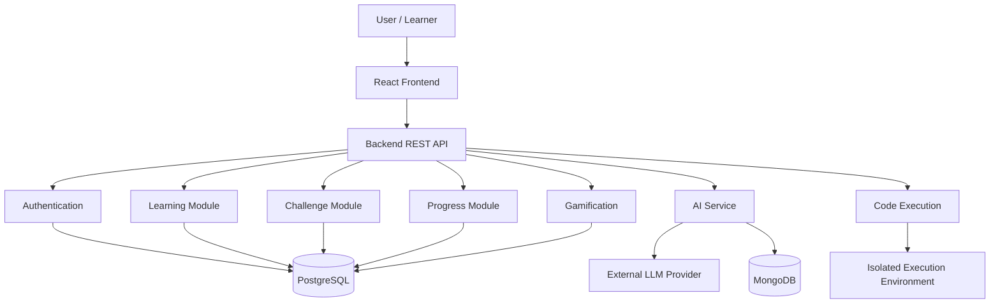
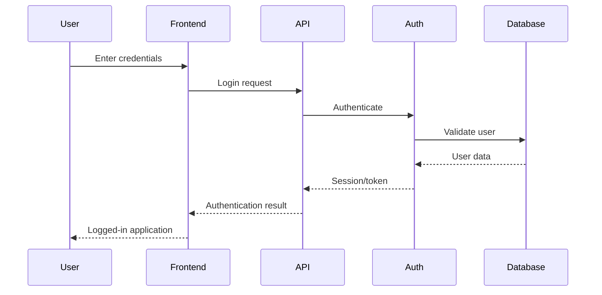
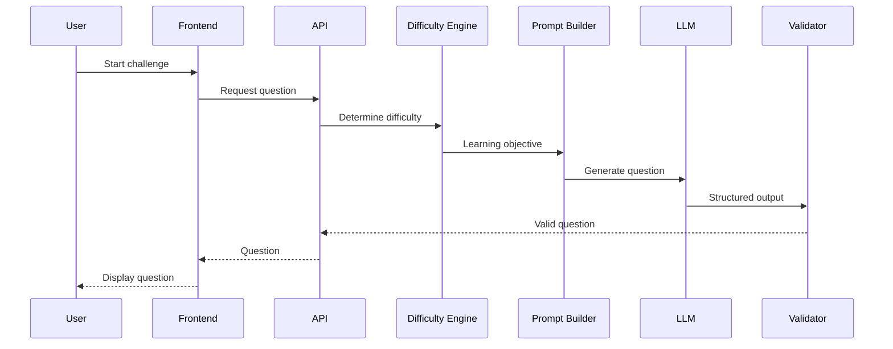
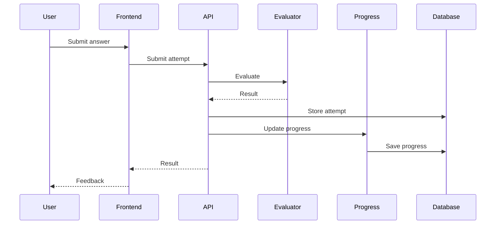

# High-Level Design — CodeQuest

---

## 1. Document Overview

### 1.1 Purpose

The purpose of this High-Level Design (HLD) document is to establish the macro-system architecture, subsystem boundaries, inter-tier communication protocols, data persistence topology, and security posture for **CodeQuest**.

This document serves as the architectural foundation bridging the requirements defined in the Product Requirements Document (`docs/PRD.md`) to the detailed implementation specifications defined in the Low-Level Design (`docs/LLD.md`).

It provides technical reviewers, viva evaluators, software architects, and developers with a defensible blueprint of how the complete platform operates as a cohesive, reliable, secure, and scalable system.

### 1.2 Scope

This document covers:

- System context and runtime boundaries
- Frontend architecture
- Backend architecture
- REST API architecture
- Database architecture
- AI/LLM architecture
- Adaptive difficulty architecture
- Learning architecture
- Challenge architecture
- Blockly / visual coding architecture
- Code execution architecture
- Authentication and authorization
- Security architecture
- Error handling
- Environment and secrets
- Logging and observability
- Rate limiting
- Caching
- Deployment
- Scalability
- Project Score alignment
- Architectural tradeoffs
- Risks and mitigations
- Future evolution
- HLD → LLD boundary

### 1.3 Intended Audience

- Technical Viva Evaluators
- Project Assessors
- Full-Stack Developers
- Software Architects
- Technical Reviewers
- Future contributors to CodeQuest

### 1.4 Architectural Hierarchy

CodeQuest follows this engineering documentation hierarchy:

$$
\mathbf{PRD}
\rightarrow
\mathbf{HLD}
\rightarrow
\mathbf{LLD}
\rightarrow
\mathbf{Implementation}
\rightarrow
\mathbf{Testing}
\rightarrow
\mathbf{Deployment}
$$

```text
PRD
│
│  WHAT and WHY
▼
HLD
│
│  HIGH-LEVEL SYSTEM ARCHITECTURE
▼
LLD
│
│  EXACT IMPLEMENTATION DESIGN
▼
Implementation
│
▼
Testing
│
▼
Deployment
```

### 1.5 Current Project Implementation Status

To maintain technical accuracy, features are classified as:

- **Implemented** — Verified implementation exists in the repository.
- **Partially Implemented** — Some implementation exists but is incomplete.
- **Planned (MVP)** — Architecturally defined and intended for MVP implementation.
- **Planned (Phase 2/3/4)** — Intended for later development phases.
- **Future** — Possible post-MVP enhancement.
- **Not Applicable** — Not justified for the current product.

| System Subsystem | Status | Architectural Role |
|---|---|---|
| Git workflow | Implemented | Branching and documentation workflow |
| PRD | Implemented | Product requirements source |
| HLD | Implemented | High-level architecture |
| LLD | Branch-Isolated / Planned | Detailed implementation design |
| React Frontend | Planned / Based on repository | User-facing application |
| Express Backend | Planned / Based on repository | REST API and business logic |
| MongoDB | Planned | Flexible document persistence |
| PostgreSQL | Planned / Phase 4 | Relational social/system data |
| AI/LLM Integration | Planned / Phase 2 | Dynamic question generation |
| Adaptive Difficulty | Planned / Phase 2 | Deterministic learning progression |
| Code Execution | Planned | Safe learner-code execution |
| Redis | Future | Caching and rate limiting |

---

## 2. Product Overview

**CodeQuest** is a professional gamified coding-learning platform designed to help learners progress from beginner-friendly programming experiences toward real software development.

The core learning philosophy is:

**PLAY → BUILD → UNDERSTAND → CODE → MASTER**

The platform combines:

- Interactive coding challenges
- Visual/block-based programming
- AI-generated questions
- Progressive difficulty
- Debugging
- Real programming
- Progress tracking
- XP
- Achievements
- Adaptive learning
- Future multi-language programming support

The product should feel like a modern developer-learning platform rather than a children's educational application.

---

## 3. Product and UI Direction

The visual design should communicate a professional developer environment.

### Visual Characteristics

- Near-black / dark navy background
- Cyan accents
- Electric blue accents
- Restrained violet accents
- Restrained green accents
- Code-editor-inspired panels
- Terminal-inspired elements
- Subtle grid/circuit patterns
- Premium dashboard
- High information density without visual clutter
- Subtle glow
- Professional micro-interactions
- Strong typography and hierarchy

### Avoid

- Childish UI
- Cartoon mascots
- Excessive emojis
- Toy-like visuals
- Bright children's-game aesthetics
- Hacker/security-tool aesthetics

Gamification should be integrated into the developer experience rather than making the platform look like a children's game.

---

## 4. Learning Model

The learner progressively moves through:

1. Recognition
2. Construction
3. Application
4. Debugging
5. Problem Solving
6. Real Code
7. Advanced Reasoning / Optimization / Projects

The core learning hierarchy is:

```text
Learning Path
      ↓
Level
      ↓
Concept
      ↓
Challenge
      ↓
Attempt
      ↓
Result
      ↓
Progress
```

Each learner should receive challenges appropriate to their current level and concept mastery.

---

## 5. Architecture Goals

The architecture is designed around:

- Maintainability
- Simplicity
- Security
- Scalability
- Extensibility
- Testability
- Good learner experience
- Reliable AI integration
- Explainable adaptive learning
- Safe code execution
- Clear separation of responsibilities
- Viva-defensible engineering decisions

The system should avoid unnecessary infrastructure.

Technologies should be introduced only when they solve a real product or engineering problem.

---

## 6. Architecture Principles

### 6.1 Simplicity Before Complexity

Prefer a modular monolith initially rather than introducing microservices without a concrete scaling requirement.

### 6.2 Clear Responsibilities

Each major subsystem should have a clearly defined responsibility.

### 6.3 Backend-Controlled AI

LLM requests should pass through the backend.

The frontend should never contain private LLM credentials.

### 6.4 Application-Controlled Curriculum

The application controls:

- Learning paths
- Levels
- Concepts
- Difficulty boundaries
- Learning objectives
- Progression rules
- Evaluation rules

The LLM generates content within those constraints.

### 6.5 Never Trust External Input

User input, external service responses, and LLM output must be validated before being trusted by business logic.

### 6.6 Safe Code Execution

Learner code must not execute directly inside the primary API process.

### 6.7 Secure Configuration

Secrets must be provided through environment variables or secure secret management.

### 6.8 Design for Failure

Databases, AI providers, network services, and execution environments can fail and must have defined failure behavior.

---

# 7. High-Level System Architecture



The exact database and infrastructure topology must follow actual repository implementation and justified product requirements.

---

# 8. Major System Components

## 8.1 Frontend Application

Responsible for:

- User interface
- Navigation
- Learning experience
- Challenge interaction
- Blockly interaction
- Code editing
- Progress display
- Gamification display
- API communication

## 8.2 Backend API

Responsible for:

- Business logic
- Authentication
- Authorization
- Learning operations
- Challenge operations
- Progress
- Gamification
- AI integration
- Code execution orchestration
- Database communication

## 8.3 Authentication Module

Responsible for:

- Registration
- Login
- Authentication
- Session/token handling
- Authorization

## 8.4 Learning Module

Responsible for:

- Learning paths
- Levels
- Concepts
- Curriculum progression

## 8.5 Challenge Module

Responsible for:

- Challenge retrieval
- Challenge submission
- Attempt management
- Challenge evaluation

## 8.6 Progress Module

Responsible for:

- Learner progress
- Concept mastery
- Attempt history
- Progression state

## 8.7 Gamification Module

Responsible for:

- XP
- Achievements
- Streaks
- Completion rewards

## 8.8 AI Service

Responsible for:

- Prompt construction
- LLM communication
- Structured output handling
- Output validation
- AI question generation

## 8.9 Adaptive Difficulty Engine

Responsible for determining appropriate challenge difficulty based on application-controlled learner state.

## 8.10 Code Execution Module

Responsible for orchestrating learner-code execution through an isolated execution environment.

---

# 9. Frontend Architecture

The frontend follows a component-based architecture.

Conceptually:

```text
Application
├── Layout
│   ├── Header
│   ├── Sidebar
│   └── Main Content
│
├── Dashboard
├── Learning Path
├── Level
├── Challenge
│   ├── Question
│   ├── Blockly Editor
│   ├── Code Editor
│   └── Result
│
├── Progress
└── Profile
```

The exact structure must follow the repository implementation.

The frontend is responsible for presentation and interaction.

Business-critical progression decisions remain authoritative on the backend.

---

# 10. React Architecture

The frontend uses React component composition.

Important React concepts include:

- Component composition
- `useState`
- `useEffect`
- Event handlers
- Async data fetching
- Client-side routing
- Loading states
- Error states

State should be owned by the narrowest appropriate component or state layer.

Unnecessary global state should be avoided.

---

# 11. Client-Side Routing

The application should use client-side routing for major application areas.

Representative route structure:

```text
/
├── login
├── register
├── dashboard
├── learn
├── learn/:levelId
├── challenge/:challengeId
└── profile
```

Routes may be classified as:

- Public
- Protected
- Dynamic
- Not-found

Actual routes must follow repository implementation.

---

# 12. Frontend Data Flow

General flow:

```text
User Action
    ↓
React Component
    ↓
State / Event Handler
    ↓
API Client
    ↓
HTTP Request
    ↓
Backend API
    ↓
HTTP Response
    ↓
State Update
    ↓
UI Update
```

The frontend should represent:

- Loading
- Success
- Error
- Empty
- Retry

states where appropriate.

---

# 13. Backend Architecture

The backend follows a modular architecture.

Conceptually:

```text
HTTP Request
     ↓
Routes
     ↓
Middleware
     ↓
Controllers
     ↓
Services
     ↓
Repositories / Data Access
     ↓
Database
```

The backend owns business rules that cannot safely be trusted to the client.

---

# 14. Backend Modules

Major conceptual modules include:

### Authentication

Handles identity and access.

### Users

Handles learner profile data.

### Learning

Handles learning paths, levels, and concepts.

### Challenges

Handles challenge retrieval and submissions.

### Attempts

Handles learner challenge attempts.

### Progress

Handles mastery and progression.

### Gamification

Handles XP and achievements.

### AI

Handles LLM-based question generation.

### Evaluation

Handles answer/code evaluation.

### Code Execution

Handles safe learner-code execution orchestration.

---

# 15. REST API Architecture

The system uses resource-oriented REST APIs.

Representative endpoints:

```text
GET    /api/levels
GET    /api/levels/:id
GET    /api/challenges/:id
POST   /api/challenges/:id/attempts
GET    /api/progress
POST   /api/ai/questions
```

The exact endpoint structure must match the implemented application.

REST APIs should use standard HTTP methods and appropriate HTTP status codes.

---

# 16. HTTP Status Codes

| Status | Meaning |
|---|---|
| 200 | Successful request |
| 201 | Resource created |
| 204 | Successful request with no response body |
| 400 | Invalid request |
| 401 | Unauthenticated |
| 403 | Unauthorized |
| 404 | Resource not found |
| 409 | Conflict |
| 422 | Validation failure |
| 429 | Rate limit exceeded |
| 500 | Internal server error |

The API should not return `200 OK` for failed operations simply to simplify frontend handling.

---

# 17. Database Architecture

The system should use database technologies based on actual product requirements.

## PostgreSQL

PostgreSQL is appropriate for structured relational data such as:

- Users
- Learning paths
- Levels
- Concepts
- Challenges
- Attempts
- Progress
- Achievements
- Social or collaborative data

The relational model provides:

- Primary keys
- Foreign keys
- Referential integrity
- Transactions
- SQL JOINs

## MongoDB

MongoDB may be appropriate for flexible document-oriented data such as:

- AI-generated questions
- Flexible AI metadata
- Evaluation artifacts

MongoDB should not be introduced merely to satisfy a Project Score requirement.

---

# 18. Learning Architecture

The learning domain follows:

```text
Learning Path
      ↓
Level
      ↓
Concept
      ↓
Challenge
      ↓
Attempt
      ↓
Result
      ↓
Progress
```

The backend maintains authoritative learning state.

The frontend displays learning state but should not independently decide whether a learner has mastered a concept.

---

# 19. Challenge Architecture

A typical challenge lifecycle is:

```text
Select Challenge
      ↓
Load Challenge
      ↓
Start Attempt
      ↓
Learner Interaction
      ↓
Submit Answer
      ↓
Evaluate
      ↓
Store Result
      ↓
Update Progress
      ↓
Award XP
      ↓
Determine Next Challenge
```

Possible challenge types include:

- Multiple choice
- Output prediction
- Debugging
- Blockly
- Real code
- Short answer

Only implemented or explicitly planned challenge types should be represented as current functionality.

---

# 20. Blockly / Visual Coding Architecture

The visual coding system creates a bridge between beginner-friendly block programming and real programming.

High-level flow:

```text
Visual Blocks
      ↓
Generated Code
      ↓
Validation
      ↓
Execution
      ↓
Output
      ↓
Evaluation
      ↓
Feedback
```

The visual editor should remain isolated from core backend business logic.

---

# 21. Code Execution Architecture

Arbitrary learner code should not execute directly inside the primary API process.

Recommended architecture:

```text
Frontend
    ↓
Backend API
    ↓
Execution Request
    ↓
Isolated Worker / Sandbox
    ↓
Language Runtime
    ↓
Execution Output
    ↓
Evaluator
    ↓
Backend
    ↓
Frontend
```

The execution environment should enforce:

- CPU limits
- Memory limits
- Timeouts
- Output limits
- Filesystem restrictions
- Network restrictions
- Process isolation
- Infinite-loop protection

If the current implementation uses a browser Web Worker, the Web Worker remains the execution boundary and should include a watchdog timeout.

---

# 22. AI / LLM Architecture

AI integration should be backend-controlled.

```text
Frontend
    ↓
Backend API
    ↓
AI Service
    ↓
Difficulty Engine
    ↓
Prompt Builder
    ↓
LLM Provider
    ↓
Structured Output
    ↓
Validation
    ↓
Question
    ↓
Frontend / Database
```

Backend-controlled AI integration provides:

- API-key protection
- Cost control
- Rate limiting
- Prompt protection
- Output validation
- Centralized monitoring

---

# 23. AI Adaptive Learning

The adaptive-learning architecture is:

```text
Learner State
      ↓
Difficulty Engine
      ↓
Learning Objective
      ↓
Prompt Builder
      ↓
LLM
      ↓
Structured Question
      ↓
Learner Answer
      ↓
Evaluation
      ↓
Progress Update
      ↓
Next Difficulty
```

The learner state may include:

- Current level
- Current concept
- Accuracy
- Recent mistakes
- Attempts
- Hint usage
- Concept mastery
- Recent performance

The application determines progression.

The LLM generates content.

This separation makes progression:

- Deterministic
- Testable
- Explainable
- Consistent
- Safer

---

# 24. Structured AI Output

The LLM should produce structured data rather than uncontrolled natural-language responses.

Conceptually:

```text
LLM
 ↓
Structured Response
 ↓
Schema Validation
 ↓
Business Validation
 ↓
Store / Return
 ↓
Frontend
```

Invalid output should trigger an appropriate retry, fallback, or error response.

The application must not blindly trust generated output.

---

# 25. Prompt Engineering Architecture

Prompt generation should combine:

```text
Application Rules
      +
Learning Objective
      +
Learner Context
      +
Difficulty
      +
Question Type
      ↓
Prompt Builder
      ↓
LLM
```

The prompt should constrain the LLM to the curriculum scope defined by the application.

Learner-provided content must be treated as untrusted input.

---

# 26. Authentication and Authorization

Where authentication is implemented or planned, the architecture includes:

```text
User
 ↓
Frontend
 ↓
Authentication API
 ↓
Authentication Service
 ↓
Database
 ↓
Session / Token
 ↓
Frontend
```

Protected resources must verify authentication and authorization on the backend.

Client-side route protection alone is insufficient.

---

# 27. Middleware Architecture

The backend request pipeline may include:

```text
Request
 ↓
CORS / Security
 ↓
Logging
 ↓
Authentication
 ↓
Authorization
 ↓
Validation
 ↓
Controller
 ↓
Service
 ↓
Response
```

Centralized error handling should process unexpected errors.

---

# 28. Error Handling Architecture

Major error categories include:

- Validation errors
- Authentication errors
- Authorization errors
- Database errors
- LLM errors
- Code execution errors
- Not-found errors
- Rate-limit errors
- Unexpected server errors

Conceptually:

```text
Error
 ↓
Central Error Handler
 ↓
Logging
 ↓
Safe Client Response
```

Internal stack traces and secrets should never be exposed to end users.

---

# 29. Security Architecture

Security controls include:

- Authentication
- Authorization
- Input validation
- Secure secret management
- CORS configuration
- Secure headers
- Rate limiting
- SQL injection prevention
- NoSQL injection prevention
- XSS protection
- Prompt injection defenses
- LLM output validation
- Code execution isolation

Security requirements must be applied according to the actual technology stack.

---

# 30. Prompt Injection Defense

Learner input must be treated as untrusted content.

Conceptually:

```text
Trusted Application Instructions
        +
Untrusted Learner Input
        ↓
Prompt Construction
        ↓
LLM
        ↓
Structured Output
        ↓
Validation
        ↓
Business Rules
```

The LLM must not be allowed to override:

- Curriculum rules
- Difficulty boundaries
- Progression rules
- Application policies

---

# 31. Environment and Secrets

Sensitive configuration must be stored outside source code.

Examples:

```text
DATABASE_URL
LLM_API_KEY
JWT_SECRET
API_URL
```

Use:

```text
.env
.env.example
```

Real credentials must never be committed to Git.

Private LLM credentials must never be exposed in frontend JavaScript.

---

# 32. Logging and Observability

The system should support appropriate logging for:

- API requests
- Errors
- API latency
- Database failures
- LLM failures
- Code execution failures

The system must not log:

- Passwords
- API keys
- Tokens
- Sensitive learner information

---

# 33. Rate Limiting

Rate limiting is particularly important for:

- Login
- Challenge submission
- AI question generation
- Public endpoints

AI endpoints may require stricter limits because each request can have a direct financial cost.

---

# 34. Caching

Caching should only be introduced where it provides measurable benefit.

Potential candidates include:

- Learning-path metadata
- Static challenge metadata
- Frequently requested configuration
- Other low-volatility data

Any cache should have:

- Defined ownership
- TTL
- Invalidation strategy
- Failure behavior

Redis should not be introduced unless justified.

---

# 35. External System Integrations

| System | Purpose | Status |
|---|---|---|
| LLM Provider | AI question generation | Planned / Implemented |
| Code Execution Environment | Safe learner-code execution | Planned / Implemented |
| Cloud Database | Persistent data | Environment dependent |
| Authentication Provider | Identity management | Optional |
| Analytics | Product insights | Future |

Actual status must reflect repository evidence.

---

# 36. High-Level Data Flows

## 36.1 Login



## 36.2 AI Question Generation



## 36.3 Challenge Submission



---

# 37. Deployment Architecture

A potential production architecture is:

```text
User
 ↓
Frontend Hosting
 ↓
Backend API
 ↓
Database

Backend API
 ↓
LLM Provider

Backend API
 ↓
Isolated Execution Environment
```

Production requirements should include:

- HTTPS
- Secure environment configuration
- Production database
- Backend hosting
- Frontend hosting
- Monitoring
- Backup strategy
- CI/CD where appropriate

Actual deployment should reflect the current project stage.

---

# 38. Scalability

The architecture can scale through:

- Stateless backend processes
- Horizontal API scaling
- Database indexing
- Pagination
- Caching
- Background jobs
- Dedicated AI limits
- Dedicated execution workers

Microservices should not be introduced unless system scale or organizational requirements justify them.

---

# 39. Modular Monolith Decision

For the initial product, a modular monolith is preferable to microservices.

Advantages:

- Lower complexity
- Easier development
- Easier deployment
- Easier debugging
- Lower infrastructure requirements
- Clear module boundaries

Potential future extraction candidates include:

- AI service
- Code execution workers
- Analytics
- Notifications

These should only become independent services when actual scale or operational requirements justify the change.

---

# 40. Technology Stack

| Technology | Purpose | Status | Architectural Reason |
|---|---|---|---|
| React | Frontend UI | Planned / Implemented | Component-based UI |
| TypeScript | Type safety | Planned / Implemented | Maintainability and safer refactoring |
| REST API | Client/server communication | Planned / Implemented | Simple resource-oriented communication |
| Node.js | Backend runtime | Planned / Implemented | Async I/O and JavaScript ecosystem |
| Express | Backend API framework | Planned / Implemented | Lightweight REST API framework |
| PostgreSQL | Relational data | Planned / Phase 4 | Strong relationships and integrity |
| MongoDB | Flexible documents | Planned | Flexible document-oriented data |
| LLM Provider | AI question generation | Planned / Phase 2 | Dynamic learning content |
| Blockly | Visual programming | Planned / Implemented | Beginner-friendly coding bridge |
| Redis | Caching/rate limiting | Future | Only when scale requires it |
| Web Worker | Client-side execution isolation | Planned | Prevent blocking main UI thread |

---

# 41. Project Score Mapping

| # | Mandatory Concept | Architecture Area | Status |
|---|---|---|---|
| 1 | React component composition | Frontend architecture | Planned / Implemented |
| 2 | useState | React state | Planned / Implemented |
| 3 | useEffect | React side effects | Planned / Implemented |
| 4 | Async data fetching from API | Frontend/API | Planned / Implemented |
| 5 | Client-side routing | Frontend routing | Planned / Implemented |
| 6 | Problem modeling | Learning domain | Planned |
| 7 | System design basics | Overall architecture | Implemented |
| 8 | RESTful endpoint design | Backend API | Planned |
| 9 | Correct HTTP status codes | API/error handling | Planned |
| 10 | Server-side error handling | Backend | Planned |
| 11 | Middleware | Backend request pipeline | Planned |
| 12 | Mongo schema modeling | MongoDB architecture | Planned |
| 13 | Mongo CRUD | MongoDB data access | Planned |
| 14 | PostgreSQL relational schema with PK/FK | Relational architecture | Planned / Phase 4 |
| 15 | SQL JOINs | Relational data access | Planned / Phase 4 |
| 16 | LLM API integration | AI architecture | Planned / Phase 2 |
| 17 | Prompt engineering | AI architecture | Planned / Phase 2 |
| 18 | Structured outputs | AI architecture | Planned / Phase 2 |
| 19 | Git workflow | Engineering workflow | Implemented |
| 20 | Environment variables/secrets | Configuration/security | Planned |
| 21 | JavaScript event loop | Async application behavior | Planned |
| 22 | Promises vs callbacks | Async JavaScript | Planned |
| 23 | async/await | Async API/AI/database calls | Planned |
| 24 | Closures | JavaScript/React behavior | Planned |
| 25 | Hoisting | JavaScript runtime | Planned |

The implementation status must be updated based on verified repository evidence.

---

# 42. Optional Architectural Concepts

| Optional Concept | Architectural Role | Justification |
|---|---|---|
| Validation | API and AI boundaries | Prevents malformed data |
| Loading/Error UI | Frontend UX | Provides feedback during async operations |
| Responsive Design | Frontend | Supports different screen sizes |
| Deployment | Infrastructure | Required for production |
| Authentication | Security | Protects learner accounts |
| Authorization | Security | Controls resource access |
| Rate Limiting | Security and cost | Prevents abuse |
| Prompt Injection Defense | AI Security | Protects system instructions |
| Cost Monitoring | AI Operations | Controls LLM expenditure |
| Docker | Reproducibility | Consistent environments |
| Redis | Caching | Useful at higher traffic |
| WebSockets | Real-time communication | Only if future features require it |
| RAG | Advanced AI | Only if knowledge retrieval becomes necessary |
| Function Calling | AI workflows | Only when structured external actions are required |
| LLM Evaluation | AI quality | Measures generated content quality |

Optional technologies should only be implemented when they have a genuine product or engineering purpose.

---

# 43. JavaScript Runtime Architecture

The application relies on JavaScript's asynchronous runtime.

## Event Loop

The event loop allows asynchronous work to be coordinated without blocking the main JavaScript execution thread.

Examples include:

- API requests
- Database operations
- LLM requests
- Timers
- Event handlers

## Promises

Promises represent asynchronous results.

## async/await

`async/await` provides readable asynchronous control flow for:

- API calls
- Database operations
- LLM requests
- Service operations

## Callbacks

Callbacks may appear in event handlers and lower-level asynchronous APIs.

## Closures

Closures naturally appear in:

- Event handlers
- React callbacks
- Utility functions
- Service functions

## Hoisting

Understanding JavaScript declaration and initialization behavior is important when reasoning about application execution.

These concepts should be connected to actual repository code during implementation and viva preparation.

---

# 44. Risks and Mitigations

| Risk ID | Risk | Severity | Probability | Architectural Mitigation |
|---|---|---|---|---|
| RSK-01 | LLM hallucinations / invalid content | High | Medium | Structured output, validation, verified fallback questions |
| RSK-02 | Prompt injection | High | Medium | Server-side prompt construction and validation |
| RSK-03 | Uncontrolled AI costs | Medium | Medium | Rate limiting, caching, model selection |
| RSK-04 | Infinite loops during code execution | High | High | Isolated execution and hard timeout |
| RSK-05 | Quiz answer leakage | High | Medium | Never expose correct answers to clients before evaluation |
| RSK-06 | Concurrent XP exploits | Medium | Low | Atomic database updates and server-side authority |
| RSK-07 | AI provider outage | High | Low | Graceful fallback to verified static questions |
| RSK-08 | Difficulty miscalibration | Medium | Medium | Deterministic progression rules and remediation |
| RSK-09 | Over-engineered architecture | Medium | Medium | Modular monolith and phased infrastructure |
| RSK-10 | Database failure | High | Low | Backups, monitoring, retry/failure handling |
| RSK-11 | API abuse | Medium | Medium | Authentication and rate limiting |
| RSK-12 | Vendor lock-in | Medium | Medium | Encapsulated external-service integrations |

---

# 45. Future Evolution

The CodeQuest architecture supports phased post-MVP expansion.

### Phase 2 — Adaptive AI Engine

- Server-side LLM pipeline
- Adaptive difficulty engine
- Bloom-based learning calibration
- Mistake remediation
- Structured AI output validation

### Phase 3 — Multi-Language Execution

- Additional programming languages
- WebAssembly runtimes
- Client-side Python execution
- Additional sandboxed runtimes

### Phase 4 — Social and Relational Systems

- Developer guilds
- Collaborative quests
- Team challenges
- Competitive leaderboards
- PostgreSQL relational features
- SQL JOIN-based analytics

### Phase 5 — Advanced Coding Arena

- Full-screen IDE mode
- Monaco editor
- Multi-file workspaces
- Project-based learning
- Git portfolio integration

Potential future technologies include:

- Redis
- Background queues
- RAG
- LLM evaluations
- Function calling
- Multi-step AI agents
- WebSockets
- Mobile clients

These remain future capabilities unless supported by actual implementation.

---

# 46. HLD → LLD Boundary

| Architectural Concern | Defined in HLD | Detailed in LLD |
|---|---|---|
| Component Topology | Major subsystem roles and communication | Exact component hierarchy, props, state |
| REST APIs | Resource types, HTTP methods, status codes | Exact request/response schemas |
| Data Persistence | Database responsibilities and technology selection | Exact schemas, fields, indexes, DDL |
| Code Execution | Isolation boundary and security requirements | Exact execution protocol and worker implementation |
| AI Integration | AI pipeline and architectural boundaries | Exact prompt schemas, validation schemas, retry logic |
| Adaptive Learning | High-level progression model | Exact formulas and state transitions |
| Middleware | Responsibilities and request pipeline | Exact middleware implementation |
| Authentication | Authentication architecture | Exact token/session implementation |
| Security | Security principles | Exact validation and security mechanisms |
| Deployment | Major infrastructure | Exact deployment configuration |

The HLD defines the architecture.

The LLD will define implementation details.

The LLD must expand the HLD rather than contradict or replace it.

---

# 47. Key Architectural Decisions for Viva

The following decisions should be understood and defended during the technical viva:

1. Why React?
2. Why component-based architecture?
3. Why REST?
4. Why PostgreSQL?
5. Why MongoDB?
6. Why use both databases if both are used?
7. Why not use microservices?
8. Why does the backend communicate with the LLM?
9. Why should the frontend never contain the LLM API key?
10. Why use structured AI outputs?
11. Why does the application control adaptive difficulty?
12. Why should the LLM not control progression?
13. How is arbitrary learner code isolated?
14. How are failures handled?
15. How are HTTP status codes selected?
16. How does middleware protect the API?
17. Where are Promises used?
18. Where is async/await used?
19. How does the event loop affect the system?
20. Where are closures used?
21. What is hoisting?
22. How are secrets protected?
23. How would the system scale?
24. What happens if the LLM provider becomes unavailable?
25. What happens if the database becomes unavailable?
26. How would the system support additional programming languages?
27. Why is the architecture modular rather than microservice-based?
28. Why should business-critical progression remain server-controlled?
29. How is learner-generated code prevented from compromising the platform?
30. How are AI-generated questions validated before reaching learners?

---

# 48. Final Architecture Summary

The intended CodeQuest architecture is:

```text
                         ┌─────────────────────┐
                         │       Learner       │
                         └──────────┬──────────┘
                                    │
                                    ▼
                         ┌─────────────────────┐
                         │ React Frontend      │
                         │ Dashboard           │
                         │ Learning            │
                         │ Challenges          │
                         │ Blockly / Code      │
                         └──────────┬──────────┘
                                    │ REST
                                    ▼
                         ┌─────────────────────┐
                         │ Backend API         │
                         │                     │
                         │ Authentication      │
                         │ Learning            │
                         │ Challenges          │
                         │ Progress            │
                         │ Gamification        │
                         │ AI                  │
                         │ Evaluation          │
                         │ Code Execution      │
                         └───────┬─────┬───────┘
                                 │     │
                    ┌────────────┘     └──────────────┐
                    ▼                                 ▼
          ┌──────────────────┐              ┌──────────────────┐
          │ PostgreSQL       │              │ AI Service       │
          │ Relational Data  │              │ Prompt Builder   │
          │ Progress         │              │ Validation       │
          │ Challenges       │              └────────┬─────────┘
          │ Users            │                       │
          └──────────────────┘                       ▼
                                             ┌──────────────────┐
                                             │ LLM Provider     │
                                             └──────────────────┘

                    Backend
                       │
                       ▼
             ┌──────────────────────┐
             │ Isolated Execution   │
             │ Environment          │
             └──────────────────────┘
```

The central architectural principle is:

**The application owns the learning system; AI enhances the learning system.**

Business-critical decisions such as progression, XP, curriculum boundaries, and learner state remain application-controlled.

AI is used where it provides value: generating flexible learning content, explanations, hints, and personalized practice.

The architecture should remain deterministic where correctness matters, flexible where AI provides value, and secure wherever user-generated code or external services are involved.

---

*End of High-Level Design Document.*