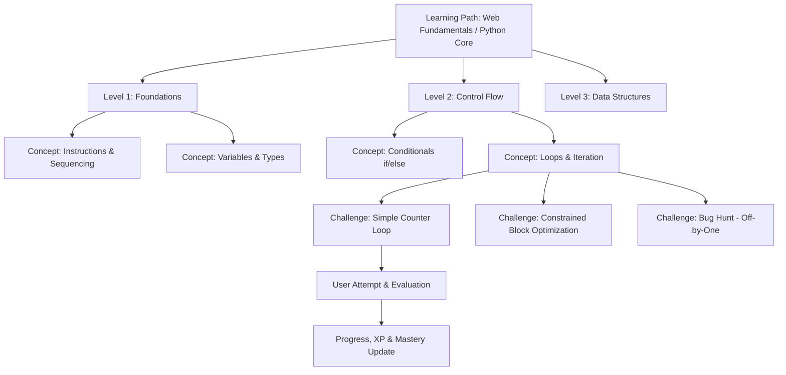

# CodeVerse — Product Requirements Document (PRD)

---

## 1. Document Information

- **Project Name:** CodeVerse
- **Document Version:** 1.0.0
- **Status:** Draft / Ready for Review
- **Date:** October 2, 2026
- **Product Type:** Professional Gamified Coding-Learning Web Platform
- **Target Audience:** Engineering Viva Evaluators, System Architects, Full-Stack Developers
- **Core Philosophy:** PLAY → BUILD → UNDERSTAND → CODE → MASTER

---

## 2. Product Overview

**CodeVerse** is a professional gamified coding-learning web platform engineered to guide beginners from foundational programming concepts to real-world code fluency through interactive visual challenges, deterministic feedback, and adaptive difficulty.

Traditional programming education suffers from a steep initial cognitive barrier: beginners are forced to memorize cryptic syntax and punctuation rules before grasping fundamental algorithmic logic. Existing educational platforms tend to polarize between dry, text-heavy documentation or childish, toy-like games with cartoon mascots.

CodeVerse solves this dilemma by presenting a **serious developer-grade cyber tool aesthetic** integrated with structured gamification mechanics. Learners manipulate visual programming blocks, observe immediate graphical execution feedback, inspect live-synchronized syntax in real programming languages (such as JavaScript and Python), and conquer progressively challenging problem sets. The platform features an adaptive AI-assisted question engine bounded by strict curriculum guardrails, ensuring learners remain in an optimal state of cognitive flow.

---

## 3. Vision

To empower any beginner—regardless of prior background—to master computational thinking, algorithmic problem solving, and software engineering principles through an engaging, visually concrete, and technically rigorous learning progression.

```text
No Coding Experience
        ↓
Programming Concepts
        ↓
Visual Blocks
        ↓
Coding Challenges
        ↓
Problem Solving
        ↓
Real Code
        ↓
Programming Languages
        ↓
Projects
        ↓
Advanced Programming
```

### The Core Learning Pipeline

$$\mathbf{PLAY} \longrightarrow \mathbf{BUILD} \longrightarrow \mathbf{UNDERSTAND} \longrightarrow \mathbf{CODE} \longrightarrow \mathbf{MASTER}$$

1. **PLAY:** Engage with interactive puzzles where actions produce immediate visual outcomes without syntax penalties.
2. **BUILD:** Assemble logic, control flow, and data pipelines using snap-together visual blocks.
3. **UNDERSTAND:** Formulate mental models for sequencing, loops, conditions, state mutation, and functional scoping.
4. **CODE:** Inspect and write real syntax alongside visual blocks in side-by-side synchronized views.
5. **MASTER:** Solve open-ended debugging challenges, optimize algorithmic efficiency, and build complete software projects.

---

## 4. Problem Statement

### 4.1 The Syntax Barrier
When novices attempt to learn programming using traditional command-line environments or code editors, they face two distinct cognitive demands simultaneously:
1. **Algorithmic Logic:** Understanding step order, condition evaluation, loop termination, and variable scope.
2. **Syntactical Rules:** Memorizing commas, colons, semicolons, parentheses, brackets, and language-specific grammar.

A single missing quotation mark or misplaced bracket produces intimidating, opaque error messages (e.g., `SyntaxError: unexpected EOF while parsing` or `Uncaught ReferenceError`). The novice spends 85% of their initial learning time debugging punctuation rather than building computational reasoning.

### 4.2 Deficiencies in Existing Solutions
- **Static Tutorials & Video Lectures:** High rate of passive disengagement; zero immediate hands-on validation; no active problem solving.
- **Children's Block Games (e.g., Scratch):** Feature childish cartoon characters, bright rainbow palettes, and toy-like interactions that alienate university students and adult career changers; they provide no bridge to actual production syntax.
- **Competitive Coding Platforms (e.g., LeetCode, HackerRank):** Assume pre-existing syntax fluency; intimidating for beginners; lack scaffolding for foundational problem decomposition.

---

## 5. Target Users

### Primary Users
- **Absolute Beginners:** Individuals with zero programming experience who need an approachable, visual, and structured pathway into computing.
- **University & Engineering Students:** College freshmen and engineering students enrolled in introductory programming (CS1/CS2) who need a concrete mental model of execution flow, state changes, and algorithms for exams and technical assessments.
- **Visual & Kinetic Learners:** Learners who understand concepts fastest through spatial manipulation, immediate cause-and-effect visualization, and interactive experimentation.

### Secondary Users
- **Self-Taught Developers & Career Switchers:** Adults learning programming independently who require a professional, mature, and structured curriculum.
- **Transitioning Coders:** Learners who have outgrown pure drag-and-drop tools and want to learn how blocks map directly to JavaScript or Python.

---

## 6. User Personas

### Persona 1: The Frustrated Beginner Student
- **Name:** Tanushree Srivastav (Age 20)
- **Role:** 2nd-Year Computer Science / Engineering Student
- **Background:** Basic exposure to programming theory; finds compiler errors overwhelming; struggles to understand loops and recursion in textbooks.
- **Goals:** Build genuine coding confidence, understand algorithmic mechanics, pass remote-proctored technical vivas, and prepare for placement interviews.
- **Frustrations:** Passive video courses feel disconnected; error messages are confusing; traditional platforms lack structure and clear progress indicators.

### Persona 2: The Career Switcher
- **Name:** Marcus Chen (Age 28)
- **Role:** Junior Data Analyst transitioning into Software Engineering
- **Background:** Familiar with spreadsheet formulas; intimidated by full IDE setups and command-line configurations.
- **Goals:** Master JavaScript and Python fundamentals without getting bogged down in environment setup errors.
- **Frustrations:** Dislikes cartoonish children's games; finds competitive programming platforms demoralizing and inaccessible.

---

## 7. Product Goals

1. **Lower Cognitive Barrier:** Enable a first-time user to understand sequencing and run their first logical challenge within 3 minutes of opening the platform.
2. **Visual-to-Syntax Bridge:** Provide real-time code generation so every visual block assembly directly demonstrates equivalent code in target languages.
3. **Adaptive Difficulty:** Automatically calibrate challenge complexity to match the learner's demonstrated proficiency, avoiding both boredom and cognitive overload.
4. **Professional Developer Atmosphere:** Deliver a sleek, futuristic cyber SaaS aesthetic that feels like a developer tool, not a children's game.
5. **Measurable, Auditable Progression:** Track verified concept mastery, XP, streaks, and attempt logs stored deterministically on the backend.
6. **Technical Explainability:** Maintain an honest, modular architecture that can be defended and verified line-by-line during technical engineering vivas.

---

## 8. Non-Goals

The following areas are explicitly **out of scope** for the MVP:
- **No Arbitrary Remote Code Execution (RCE) on Server:** Untrusted user code will never be executed directly on backend servers; code execution will run in sandboxed client-side environments (Web Workers / WebAssembly) to eliminate server vulnerabilities.
- **No Unrestricted LLM Curriculum Generation:** The AI engine will not freely decide what concepts exist or arbitrarily award XP; the backend controls all curriculum structures, unlock criteria, and rewards.
- **No Full Production Cloud IDE:** CodeVerse is a structured learning environment, not a generic cloud IDE (like VS Code in browser) with terminal emulators and package managers.
- **No Real-Time Synchronous Multiplayer:** Synchronous multiplayer competitions, real-time WebSockets, and audio/video chat are deferred to post-MVP roadmap phases.
- **No Cartoonish Gamification:** No cartoon mascots, playful voiceovers, or toy-like gamification elements.

---

## 9. Core User Journey

```text
┌────────────────────────────────────────────────────────────────────────┐
│ 1. AUTHENTICATE & ENTER COMMAND DECK                                   │
│ Learner logs in -> Views HUD (Level, XP, Current Objective, Streak)    │
└──────────────────────────────────┬─────────────────────────────────────┘
                                   │
                                   ▼
┌────────────────────────────────────────────────────────────────────────┐
│ 2. SELECT ACTIVE LEARNING PATH & LEVEL                                 │
│ Selects concept node (e.g., "Level 2: Loops & Iteration")              │
└──────────────────────────────────┬─────────────────────────────────────┘
                                   │
                                   ▼
┌────────────────────────────────────────────────────────────────────────┐
│ 3. ENTER CHALLENGE WORKSPACE                                           │
│ Left: Mission Briefing | Center: Visual Block Canvas | Right: Dual-View│
└──────────────────────────────────┬─────────────────────────────────────┘
                                   │
                                   ▼
┌────────────────────────────────────────────────────────────────────────┐
│ 4. ASSEMBLE LOGIC & PREVIEW SYNTAX                                     │
│ Snaps blocks -> Observes real-time JavaScript/Python code generated    │
└──────────────────────────────────┬─────────────────────────────────────┘
                                   │
                                   ▼
┌────────────────────────────────────────────────────────────────────────┐
│ 5. EXECUTE & RECEIVE DETERMINISTIC FEEDBACK                            │
│ Runs program -> Visual state transitions -> Server grades attempt      │
└──────────────────────────────────┬─────────────────────────────────────┘
                                   │
                                   ▼
┌────────────────────────────────────────────────────────────────────────┐
│ 6. PROGRESS, XP AWARD & ADAPTIVE NEXT CHALLENGE                        │
│ Earns XP -> Progress recorded -> Engine adjusts next challenge tier    │
└────────────────────────────────────────────────────────────────────────┘
```

---

## 10. Learning Architecture

The curriculum is structured into an extensible, hierarchical taxonomy:

$$\text{Learning Path} \longrightarrow \text{Level} \longrightarrow \text{Concept} \longrightarrow \text{Challenge} \longrightarrow \text{Attempt} \longrightarrow \text{Progress Record}$$



- **Learning Path:** Top-level curriculum domain (e.g., "JavaScript Essentials", "Python Fundamentals", "Computational Thinking").
- **Level:** Thematic tier grouping closely related concepts (e.g., Foundations, Control Flow, Collections).
- **Concept:** A discrete programming primitive (e.g., Variables, Booleans, Conditionals, For-Loops, Functions).
- **Challenge:** An individual interactive task with defined inputs, constraints, and test assertions.
- **Attempt:** An immutable record of the learner's submitted solution, evaluation result, execution time, and XP earned.

---

## 11. Learning Levels

The progressive syllabus follows seven foundational tiers:

```text
Level 1: Computational Thinking (Instructions, sequencing, spatial actions)
   ↓
Level 2: Visual Coding (Block manipulation, snap geometry, input slots)
   ↓
Level 3: Control Flow & Logic (Branching, if/else, comparison operators)
   ↓
Level 4: Iteration & State (While-loops, counter loops, mutable variables)
   ↓
Level 5: Data Structures (Arrays, index access, collections, key-value maps)
   ↓
Level 6: Functions & Decomposition (Parameters, return values, modular code)
   ↓
Level 7: Real Code Dual-View (Block-to-text equivalence, syntax editing)
```

---

## 12. Challenge System

Every challenge in CodeVerse is designed around clear pedagogical objectives:

### Challenge Categories
1. **Predictive / Recognition Challenges:** The learner inspects a block program or code snippet and predicts its final state or return value.
2. **Construction Challenges:** The learner builds a solution from scratch using a constrained palette of blocks.
3. **Constrained Optimization Challenges:** The learner achieves the goal while respecting resource limits (e.g., "Collect all gems using at most 1 loop and no more than 4 total blocks").
4. **Bug Hunt / Debugging Challenges:** The learner receives an existing flawed program (e.g., infinite loop, off-by-one index error) and must identify and fix the defect.
5. **Syntax Translation Challenges:** The learner translates a verified visual block solution into valid typed code in the target language.

---

## 13. AI-Powered Adaptive Learning

### Architectural Role
The AI subsystem serves as an intelligent question generator and pedagogical tutor. It generates tailored practice questions based on a learner's past performance, recurring mistakes, and concept mastery scores.

> **Crucial Rule:** The AI assists learning, but **never controls game rules, XP, user permissions, or progress unlocking**. The application backend deterministically validates and owns all state.

### Input Factors for AI Adaptation
- **Current Level & Concept:** Strictly bounds the topic domain.
- **Current Difficulty Tier:** Bloom's taxonomy level (Recognition, Assembly, Debugging).
- **Demonstrated Mastery Percentage:** Running accuracy metric for the concept.
- **Error History:** Specific error categories recently encountered (e.g., infinite loop, boundary overflow).
- **Attempt Velocity:** Time spent on previous challenges.

---

## 14. AI Question Generation

### Question Synthesis Pipeline
```text
Learner Profile (Level, Concept, Mastery Rate, Error History)
                     ↓
      Difficulty Engine (Selects Bloom's Tier & Constraints)
                     ↓
   Prompt Builder (Applies Boundaries, Whitelists & JSON Schema)
                     ↓
        LLM Inference API (Low Temperature = 0.2 for Consistency)
                     ↓
       Server Validation (Zod Schema, Distractor & Answer Checks)
                     ↓
  Sanitized Question to Frontend (Correct Answer Stripped Out)
                     ↓
        Learner Solves & Submits to Server for Evaluation
```

### Safety & Guardrails
- **Syntactic Whitelist:** Prompts forbid constructs beyond the learner's unlocked tier (e.g., no asynchronous promises in a Level 1 variable challenge).
- **Deterministic JSON Schema:** The LLM is constrained to output structured JSON conforming to a strict schema containing question text, options, hint, explanation, and concept tags.
- **Graceful Fallback:** If the LLM call times out, fails schema validation, or returns malformed JSON, the system immediately serves a pre-validated question from the seed database.

---

## 15. Difficulty Progression

CodeVerse avoids crude binary difficulty adjustments. Instead, it utilizes a multi-stage cognitive staircase:

```text
[STAGE 1] Recognition ──► [STAGE 2] Construction ──► [STAGE 3] Constrained ──► [STAGE 4] Debugging ──► [STAGE 5] Code Synthesis
```

### Progression Rules
- **Low Performance (<60% accuracy on last 3 attempts):** Maintain concept; drop to Stage 1 (Recognition) or Stage 2 (Construction); provide progressive hints; reduce problem complexity.
- **Consistent Performance (60%–84% accuracy):** Maintain concept; introduce Stage 3 (Constrained optimization) or targeted remediation for observed error patterns.
- **Mastery Performance ($\ge$85% accuracy over $\ge$3 attempts):** Advance to Stage 4 (Debugging) and Stage 5 (Code synthesis). Once concept mastery reaches $\ge$90%, unlock the subsequent curriculum node.

---

## 16. Block-Based Programming

### Visual Assembly Without Syntax Frustration
The visual workspace provides an interactive spatial canvas where blocks snap together magnetically according to strict geometric and type constraints.

### Capabilities & Specifications
- **Block Categories:**
  - *Actions:* Discrete movement, drawing, or output commands.
  - *Logic & Control:* `if`, `if-else`, comparison operators (`==`, `!=`, `<`, `>`).
  - *Loops:* `repeat N times`, `while condition`, `for each item in list`.
  - *Variables:* `set variable`, `change variable by N`, read variable.
  - *Functions:* Define function with parameters, call function.
- **Type-Enforced Geometry:** A boolean condition block cannot snap into an integer slot; comparison blocks require valid operand sockets.
- **Real-Time Code Synchronization:** As blocks are added, modified, or removed, the visual Abstract Syntax Tree (AST) emits cleanly formatted code in real time in the adjacent panel.
- **Execution Controls:** Run Program, Step Through (line-by-line highlight), Pause, Reset Canvas.

---

## 17. Real Code Transition

CodeVerse actively prevents learners from becoming trapped in block-only visual abstractions:

1. **Dual-View Code Preview:** An adjacent editor panel displays the exact generated code corresponding to assembled blocks.
2. **Interactive Block-to-Syntax Highlighting:** Hovering over a visual block highlights its exact syntax representation in the code panel.
3. **Scaffolded Code Editing:** Progressively introduces fill-in-the-blank code challenges where learners edit syntax directly with auto-completion and syntax highlighting.
4. **Full Code Editor Mode:** Advanced challenges allow learners to write complete functions directly in the target language.

---

## 18. Programming Language Progression

The curriculum supports multi-language expansion along a defined trajectory:

```text
Phase 1 (MVP): JavaScript (Universal web language, instant sandboxed browser execution)
     ↓
Phase 2 (Planned): Python (Clean algorithmic syntax, ideal for data structures)
     ↓
Phase 3 (Future): Java & C++ (Strict static typing, object-oriented design, memory models)
```

---

## 19. Gamification

Gamification in CodeVerse is an intrinsic motivational engine designed to make learning tangible and satisfying, without trivializing the educational material into a childish toy.

### Gamification Elements
- **Experience Points (XP):** Earned strictly by completing challenges, quizzes, and debugging tasks.
- **Rank Titles:** Developer ranks reflecting verified mastery (e.g., *Level 1: Syntax Apprentice*, *Level 5: Logic Operative*, *Level 10: Algorithmic Architect*).
- **Streaks:** Daily practice counters encouraging consistent learning habits.
- **Achievements & Badges:** Technical accomplishment markers (e.g., *"Clean Code: Optimal block count"*, *"Bug Hunter: Resolved infinite loop on first try"*).
- **Zero Vanity Rewards:** Meaningless clicks, time spent idle, or UI browsing never yield XP.

---

## 20. XP and Progression

### Deterministic XP Economy
All XP calculations are performed and verified on the backend server:

| Challenge Type | Base XP | Bonus Criteria | Max XP |
|:---|:---:|:---|:---:|
| **Recognition Quiz (Multiple Choice)** | 10 XP | First attempt correct (+5 XP) | 15 XP |
| **Visual Block Assembly** | 25 XP | Optimal block count constraint met (+10 XP) | 35 XP |
| **Algorithmic Challenge** | 50 XP | Zero hints used (+15 XP) | 65 XP |
| **Bug Hunt (Debugging Challenge)** | 40 XP | Fixed in under 2 runs (+10 XP) | 50 XP |
| **Concept Milestone Assessment** | 100 XP | Score $\ge 90\%$ (+25 XP) | 125 XP |

### Level Threshold Formula
$$\text{XP Required for Level } N = 100 \times N^{1.5}$$

---

## 21. Dashboard Requirements

The Dashboard is the command center of CodeVerse. It must exhibit a sleek, dark cyber-tool aesthetic:
1. **Global Header (HUD):**
   - Brand identity: CodeVerse logo with cyan/blue accents.
   - User Profile Badge: Avatar, Username, Rank Title.
   - XP Meter: Visual horizontal progress bar showing current XP vs XP required for next level.
   - Streak Indicator: Active streak count with subtle amber glow.
2. **Current Objective Panel:** Highlights the active concept with a single, clear "Continue Mission" CTA.
3. **Curriculum Roadmap Canvas:** Interactive nodes representing levels and concepts, visually distinguishing between **Mastered** (emerald green), **In-Progress** (electric violet / cyan), and **Locked** (muted slate with lock icon).
4. **Performance & Mastery Matrix:** Summary cards showing concept mastery percentages and recent attempt metrics.

---

## 22. Challenge Interface Requirements

The Challenge Interface is a focused, three-column or split-view workspace:
- **Left Panel (Mission Brief):**
  - Concept explanation and objectives.
  - Clear constraints (e.g., "Max blocks: 4").
  - Expandable Hint section (reveals hints progressively, deducting potential bonus XP).
- **Center Panel (Interactive Workspace):**
  - Tool palette: Draggable block categories.
  - Canvas: Magnetic block assembly dock.
  - Action Controls: `Run Execution` (emerald accent), `Step Through`, `Reset Canvas`.
- **Right Panel (Code Matrix & Output Dock):**
  - Live Syntax View: Synchronized real-world code display (JavaScript / Python).
  - Terminal Output: Execution logs, state changes, return values, or visual output canvas.
  - Error Inspector: Friendly, diagnostic explanations of logical missteps.

---

## 23. Feedback System

### Three-Tiered Immediate Feedback Model
1. **Immediate Graphical / Execution Feedback:** Upon clicking "Run", the avatar or execution runner immediately reflects the instructions. The user sees where execution stopped.
2. **Deterministic Evaluation Result:**
   - **Success:** Emerald highlight, celebratory sound/animation, breakdown of XP earned (+Base, +Constraint Bonus).
   - **Failure:** Clear, non-punitive explanation of what went wrong (e.g., *"Expected rover position: (5, 0), Actual: (3, 0). Check your loop counter."*).
3. **AI Mentor Diagnostic Hints:** If an attempt fails twice, the AI Mentor offers a contextual Socratic hint without revealing the exact solution.

---

## 24. User Progress

### Tracked Metrics
- **Global Profile:** Total XP, current level, current streak, account creation date.
- **Curriculum Progress:** Unlocked levels, completed concepts, in-progress challenges.
- **Concept Mastery Vector:** Percentage mastery per topic (e.g., `variables: 100%`, `conditionals: 80%`, `loops: 45%`).
- **Attempt History:** Log of every submission with timestamp, user answer, correctness, and evaluation feedback.

### Persistence Guarantees
All user progress is persisted in the database; client-side storage (e.g., `localStorage`) is strictly utilized for UI session tokens and temporary cache.

---

## 25. UI/UX Requirements

### Visual Direction
- **Style:** Serious, modern developer platform. Dark SaaS aesthetic with subtle cyberpunk/terminal accents.
- **Tone:** Professional, empowering, high-tech, focused.
- **Prohibited:** No childish cartoons, no bouncing emojis, no pastel rainbow palettes, no toy-like fonts.

---

## 26. Cyber Design System

### Color Palette Tokens
- **Background Deep Space:** `#0B0F19` (Canvas base)
- **Surface Dark Navy:** `#111827` (Card and panel background)
- **Surface Elevated:** `#1E293B` (Dropdowns, modals, hover states)
- **Primary Accent (Cyan Neon):** `#06B6D4` (Active elements, focus rings)
- **Secondary Accent (Electric Blue):** `#3B82F6` (Buttons, badges)
- **Tertiary Accent (Controlled Violet):** `#8B5CF6` (Special mechanics, unlocked paths)
- **Success (Matrix Emerald):** `#10B981` (Passing tests, completed levels)
- **Warning (Amber Glow):** `#F59E0B` (Hints, streak counters)
- **Danger (Coral Red):** `#EF4444` (Failed test assertions, errors)
- **Text High Contrast:** `#F9FAFB` (Headings, primary content)
- **Text Muted:** `#9CA3AF` (Secondary descriptions, metadata)
- **Border Subtle:** `#1F2937` / `#374151` (Dividing lines, grid lines)

### Visual Principles
- **Subtle Glow & Elevation:** Restrained outer box-shadow glows on active interactive nodes (`box-shadow: 0 0 16px rgba(6, 182, 212, 0.2)`).
- **Typography:** Modern clean sans-serif (Inter) for UI elements; monospace (JetBrains Mono / Roboto Mono) for code, variables, and output logs.
- **Micro-Interactions:** Smooth CSS cubic-bezier transitions on hover, block snapping, and milestone completion.

---

## 27. Accessibility Requirements

- **Contrast Standards:** All text and critical UI elements must satisfy WCAG AA contrast standards ($\ge 4.5:1$ for body text, $\ge 3:1$ for large text).
- **Keyboard Navigation:** All workspace actions, block selections, and modals must be accessible via keyboard navigation (`Tab`, `Enter`, `Escape`, arrow keys).
- **Non-Color Indicators:** Statuses (locked vs active vs completed) must feature distinct iconography and text labels in addition to color coding.
- **Reduced Motion Support:** Respect user preference for `prefers-reduced-motion` by disabling ambient particle animations and sliding transitions.

---

## 28. Performance Requirements

- **Page Load Budget:** Initial application shell loaded and rendered in $<1.5\text{ seconds}$ on standard broadband connections.
- **Interaction Frame Rate:** Visual block dragging, docking, and live code preview generation must execute at 60 FPS ($<16\text{ms}$ frame time).
- **API Response Latency:** Curriculum queries and attempt submission endpoints must respond in $<200\text{ms}$ under standard load.
- **Execution Timeout:** Client-side sandboxed code runs must terminate after a maximum of 1,000ms to eliminate infinite loop browser freezes.

---

## 29. Security Requirements

- **Zero Hardcoded Secrets:** All secrets, connection strings, and keys must be injected via `.env` and kept out of version control.
- **Password Security:** User passwords must be irreversibly hashed using `bcryptjs` with a work factor of 10 salt rounds before storage.
- **Stateless Authentication:** Secure routes protected by JSON Web Tokens (JWT) passed via `Authorization: Bearer <token>` headers with 24-hour expiration.
- **Anti-Cheat Assessment Defense:** Quiz questions fetched by the client explicitly exclude correct answer fields (`.select("-correctAnswer")`); answers are evaluated strictly on the server.
- **Input Sanitization & Schema Validation:** All request payloads must pass strict validation middleware verifying data types, enums, and bounds before hitting database layers.
- **AI Prompt Injection Defense:** All user-provided inputs forwarded to AI prompts must be stripped of instruction overrides or markdown injection tokens.

---

## 30. Error Handling Requirements

### Three-State Asynchronous Pattern
Every asynchronous operation across frontend and backend must implement:
1. **Loading State:** Dedicated skeleton shimmer or cyber-pulse indicator with accessible ARIA live regions.
2. **Success State:** Instant DOM update and optimistic UI synchronization.
3. **Error State:** Human-readable explanations accompanied by actionable recovery options (e.g., "Retry Request", "Reset to Checkpoint").

### Error Classification
- **Validation Errors (400):** Specific, localized feedback on invalid inputs.
- **Authentication Failures (401/403):** Clear session expiration notices with redirect to login.
- **Server Faults (500):** Sanitized error messages presented to users with detailed diagnostics logged internally.
- **AI Inference Timeouts:** Transparent failover to pre-seeded static questions with zero application crashes.

---

## 31. MVP Scope

The Minimum Viable Product focuses on delivering a complete, robust, and verifiable learning loop:

### Included in MVP
1. **Developer Dashboard:** Global cyber HUD (Level, XP, Streak) and interactive learning roadmap.
2. **Learning Paths & Levels:** Initial curriculum covering Computational Thinking, Sequences, Conditionals, and Loops.
3. **Block-Based Workspace:** Visual block assembly canvas with core categories (Movement, Loops, Logic, Variables).
4. **Real-Time Code Preview:** Live synchronized JavaScript code panel matching block state.
5. **Client-Side Code Sandbox:** Safe in-browser execution runner with console output and visual execution state.
6. **Deterministic Challenge Grader:** Server-side grading of attempts, answer validation, and score calculation.
7. **XP & Progression System:** Automatic XP calculation, level-up milestones, and streak tracking.
8. **User Authentication:** Registration, login, bcrypt password hashing, and JWT session handling.
9. **Engineering Traceability:** Comprehensive mapping of academic viva competencies to codebase implementations.

---

## 32. Phased Roadmap

CodeVerse advances through four distinct implementation phases:

- **Phase 1 (MVP Core):** React 19 + Vite 6 frontend, Node.js + Express 5 backend, MongoDB persistence, JWT authentication, curriculum roadmap, static quiz engine with server-side evaluation, XP leveling system, Blockly visual workspace, and client-side browser Web Worker execution sandbox (1,000ms watchdog).
- **Phase 2 (Adaptive AI Engine):** Google Gemini 1.5 Flash integration, adaptive difficulty engine calibrated to Bloom's taxonomy staircase, dynamic prompt synthesis, structured Zod output validation, and fallback question bank.
- **Phase 3 (Production Hardening):** Comprehensive automated testing suites, GitHub Actions CI/CD pipelines, tiered rate limiting, structured logging, performance optimizations, and security auditing.
- **Phase 4 (Social & Relational Systems):** PostgreSQL 16 relational database layer for developer Guilds, collaborative quests, and weekly competitive leaderboards utilizing multi-table SQL JOINs.

*Post-Phase 4 Capabilities (Future):* Multi-language WebAssembly execution (Python via Pyodide) and full-screen text editor mode.

---

## 33. Success Metrics

1. **Challenge Completion Rate:** Target $>75\%$ completion rate on unlocked foundational challenges.
2. **Concept Mastery Velocity:** Average of $\le 4$ attempts per concept before reaching $\ge 85\%$ mastery.
3. **Daily Learning Retention:** Target $>40\%$ 7-day retention driven by daily streak mechanics.
4. **Assessment Integrity:** $0\%$ leakage of quiz answers through client-side network inspection.
5. **AI Schema Conformance:** Target $>98\%$ of generated AI questions passing schema validation on first inference attempt.

---

## 34. Project Score / Engineering Alignment

CodeVerse is specifically engineered to demonstrate mandatory computer science and full-stack engineering competencies required for remote-proctored technical vivas:

| Concept # | Mandatory Viva Concept | Architectural Role in CodeVerse | Status |
|:---:|:---|:---|:---:|
| **1** | **React Component Composition** | Modular frontend hierarchy: HUD, Roadmap, BlockWorkspace, OutputDock | 🚧 Planned (Milestone 1) |
| **2** | **State Management (useState)** | Local workspace state: active blocks, current challenge index, terminal logs | 🚧 Planned (Milestone 1) |
| **3** | **Side Effects (useEffect)** | Asynchronous topic fetching, DOM canvas mounting, timer cleanup | 🚧 Planned (Milestone 1) |
| **4** | **Async Data Fetching** | Decoupled HTTP API client consuming backend REST endpoints | 🚧 Planned (Milestone 1) |
| **5** | **Client-Side Routing** | Declarative routing between Dashboard, Challenge, and Profile arenas | 🚧 Planned (Milestone 1) |
| **6** | **Problem Modeling** | Discrete domain models: Users, Levels, Concepts, Challenges, Attempts | 🚧 Planned (Milestone 5) |
| **7** | **System Design** | Decoupled multi-tier client-server architecture with REST and AI integration | 🚧 Planned (Milestone 5) |
| **8** | **RESTful Endpoint Design** | Semantic URIs and HTTP verbs (`GET /api/topics`, `POST /api/quizzes/:id/submit`) | 🚧 Planned (Milestone 5) |
| **9** | **HTTP Status Codes** | Precise status codes: `200 OK`, `201 Created`, `400 Bad Request`, `401 Unauthorized`, `404 Not Found` | 🚧 Planned (Milestone 5) |
| **10** | **Server Error Handling** | Structured `try/catch` handlers, centralized error middleware | 🚧 Planned (Milestone 5) |
| **11** | **Express Middleware** | Custom `authMiddleware` (JWT verification) and `validationMiddleware` | 🚧 Planned (Milestone 5) |
| **12** | **MongoDB Schema Modeling** | Mongoose schemas with strict types, enums, timestamps, and relational `ref` links | 🚧 Planned (Milestone 5) |
| **13** | **MongoDB CRUD Operations** | `find()`, `findById()`, `create()`, `.select("-correctAnswer")`, `.populate()` | 🚧 Planned (Milestone 5) |
| **14** | **PostgreSQL Relational Schema** | Relational tables for Guilds, Members, and Social Graphs (PK/FK design) | 🚧 Planned (Milestone 8) |
| **15** | **SQL JOINs** | Multi-table relational queries linking Users and Guilds for leaderboard aggregation | 🚧 Planned (Milestone 8) |
| **16** | **LLM API Integration** | Backend service calling external LLM for personalized practice question generation | 🚧 Planned (Milestone 6) |
| **17** | **Prompt Engineering** | System prompts enforcing role framing, Bloom's tiers, and curriculum boundaries | 🚧 Planned (Milestone 6) |
| **18** | **Structured Outputs** | Strict JSON Schema validation guaranteeing parseable question response objects | 🚧 Planned (Milestone 6) |
| **19** | **Git Workflow** | Multi-branch workflow: `main`, `develop`, feature/docs branches, Conventional Commits | ✅ Implemented |
| **20** | **Secrets Management** | Zero secrets in source; injected via `.env` through `dotenv` | 🚧 Planned (Milestone 5) |
| **21** | **Event Loop** | Non-blocking asynchronous I/O offloading database calls to libuv worker pool | 🚧 Planned (Milestone 5) |
| **22** | **Promises vs Callbacks** | Clean Promise chains and async handling replacing legacy callback hell | 🚧 Planned (Milestone 5) |
| **23** | **async / await** | Linear asynchronous control flow across controllers and seeders | 🚧 Planned (Milestone 5) |
| **24** | **Closures** | Array iterator callbacks maintaining lexical scope over query result sets | 🚧 Planned (Milestone 5) |
| **25** | **Hoisting & Scoping** | Temporal Dead Zone enforcement with `const`/`let`; hoisted function declarations | 🚧 Planned (Milestone 1) |

---

## 35. Git Development Workflow

To ensure a pristine, professional version-control history suitable for code audits and technical assessment reviews, all development must strictly follow this branching and commit protocol:

### Branch Topology
```text
main (Production releases only)
  │
  └── develop (Integration branch)
        │
        ├── docs/prd                     <-- (Current Branch)
        ├── docs/hld
        ├── docs/lld
        ├── feature/project-setup
        ├── feature/dashboard
        ├── feature/learning-path
        ├── feature/block-editor
        ├── feature/backend-api
        ├── feature/database
        ├── feature/ai-question-engine
        ├── feature/adaptive-difficulty
        └── feature/gamification
```

### Protocol Rules
1. **Never commit directly to `main`:** `main` reflects only verified, production-stable milestones.
2. **Never commit unreviewed code directly to `develop`:** All work originates on a dedicated feature or docs branch.
3. **Atomic Feature Branches:** Create short-lived branches off `develop` (e.g., `git checkout -b docs/prd develop`).
4. **Conventional Commits:** Every commit message must use standard prefixes:
   - `feat:` (New user-facing functionality)
   - `fix:` (Bug fixes)
   - `docs:` (Documentation changes only)
   - `refactor:` (Code changes that neither fix bugs nor add features)
   - `test:` (Adding or correcting tests)
   - `chore:` (Build tasks, dependency updates, configuration)
   - `style:` (Formatting, whitespace changes)
   - `perf:` (Performance optimizations)
5. **Pull Request Protocol:**
   - Push branch to remote.
   - Open a detailed Pull Request targeting `develop`.
   - Perform self-review of git diff against acceptance criteria.
   - Merge into `develop` only after review is complete.
   - Delete feature branch post-merge.

---

## 36. User Stories

1. **US-01 (Foundational Challenges):** As a beginner, I want to start with simple visual programming challenges so that I can understand sequencing and control flow without syntactical frustration.
2. **US-02 (Block-Based Assembly):** As a learner, I want to construct programs using snap-together blocks so that I can focus entirely on computational logic.
3. **US-03 (Live Code Synchronization):** As a learner, I want to see real-world JavaScript or Python code generated in real time as I manipulate blocks so that I understand how visual logic translates into syntax.
4. **US-04 (Immediate Feedback):** As a learner, I want immediate execution feedback when running my program so that I can instantly see where my logic succeeds or fails.
5. **US-05 (Constrained Puzzles):** As a learner, I want challenges with block count constraints so that I learn to write efficient, non-redundant programs.
6. **US-06 (Bug Hunts):** As a learner, I want pre-built buggy programs to debug so that I can practice diagnostic problem solving and tracing execution flow.
7. **US-07 (Adaptive Challenges):** As a learner, I want subsequent practice questions to adapt to my demonstrated mastery so that I am neither bored by simple repetition nor overwhelmed by sudden difficulty jumps.
8. **US-08 (XP & Progression):** As a learner, I want to earn XP and level up upon completing verified challenges so that my learning progress is visually rewarding and tangible.
9. **US-09 (Streak Tracking):** As a learner, I want my consecutive days of coding tracked in a streak meter so that I stay motivated to practice daily.
10. **US-10 (Curriculum Roadmap):** As a learner, I want a visual curriculum map showing mastered, active, and locked concepts so that I always know what to learn next.
11. **US-11 (AI Diagnostic Hints):** As a learner, I want contextual Socratic hints when I fail a challenge multiple times so that I can overcome obstacles without having the answer spoiled.
12. **US-12 (Account Security):** As a learner, I want secure authentication with encrypted credentials so that my personal progress and attempt history are safely preserved.

---

## 37. Functional Requirements

- **FR-001 (User Registration):** The system shall allow a new learner to register with a username, email, and password.
- **FR-002 (Password Hashing):** The system shall hash user passwords using `bcryptjs` with at least 10 salt rounds prior to persistence.
- **FR-003 (Authentication & Tokens):** The system shall authenticate credentials and issue a signed JSON Web Token (JWT) with a defined expiration time.
- **FR-004 (Curriculum Hierarchy):** The system shall organize learning content into Learning Paths, Levels, Concepts, and Challenges.
- **FR-005 (Curriculum Querying):** The system shall provide endpoints to fetch curriculum levels, filter concepts by category, and inspect challenge requirements.
- **FR-006 (Visual Block Workspace):** The system shall provide an interactive visual canvas allowing users to drag, drop, snap, and configure logic blocks.
- **FR-007 (Real-Time Code Generation):** The system shall translate the visual block Abstract Syntax Tree into cleanly formatted target code (JavaScript/Python) in real time.
- **FR-008 (Sandboxed Client Execution):** The system shall execute user programs within a sandboxed browser environment with execution timeouts to prevent infinite loops.
- **FR-009 (Server-Side Evaluation):** The system shall evaluate submitted challenge attempts on the backend server against defined acceptance criteria.
- **FR-010 (Anti-Cheat Projection):** The system shall strip correct answers from question payloads served to clients prior to submission.
- **FR-011 (Attempt Logging):** The system shall create an immutable attempt document for every challenge submission, recording user ID, challenge ID, code, status, and score.
- **FR-012 (XP Calculation):** The system shall deterministically calculate and award XP upon successful challenge completion based on difficulty and bonus constraints.
- **FR-013 (Mastery Tracking):** The system shall update the learner's concept mastery score based on recent attempt accuracy.
- **FR-014 (Adaptive Question Generation):** The system shall eventually generate dynamic practice questions by prompting an external LLM using structured JSON schemas.
- **FR-015 (AI Output Validation):** The system shall validate all AI-generated question objects against strict schema constraints before delivering them to users.
- **FR-016 (Fallback Mechanism):** The system shall automatically fall back to pre-seeded static questions if an AI generation request fails or times out.
- **FR-017 (Streak Counter):** The system shall update daily practice streaks based on UTC calendar day activity.

---

## 38. Non-Functional Requirements

- **NFR-001 (Performance - Load Time):** The application dashboard shall load and become interactive within 1.5 seconds on a standard 10 Mbps connection.
- **NFR-002 (Performance - Frame Rate):** The visual block workspace shall maintain a minimum of 50 FPS during drag-and-drop operations on modern browsers.
- **NFR-003 (Performance - Execution Timeout):** Client-side code execution shall automatically terminate and report an error if execution exceeds 1,000 milliseconds.
- **NFR-004 (Scalability - Stateless API):** The backend REST API shall maintain stateless session management via JWTs to support horizontal scaling behind a reverse proxy.
- **NFR-005 (Security - Secrets Protection):** Zero private keys, API credentials, or database connection strings shall be committed to version control.
- **NFR-006 (Security - Payload Validation):** All incoming HTTP request parameters and JSON bodies shall be validated against defined schemas before hitting business logic.
- **NFR-007 (Accessibility - Contrast):** All text elements, interactive controls, and HUD counters shall achieve WCAG AA compliant contrast ratios ($\ge 4.5:1$).
- **NFR-008 (Maintainability - Modular Architecture):** Code shall follow strict separation of concerns (Routes $\rightarrow$ Middleware $\rightarrow$ Controllers $\rightarrow$ Services $\rightarrow$ Models).
- **NFR-009 (Reliability - Graceful Degradation):** The platform shall remain 100% operational for learning and practice even when third-party AI APIs are unreachable.
- **NFR-010 (Observability - Logging):** The backend shall log all API errors with timestamps, request methods, endpoints, and sanitized error messages.

---

## 39. Acceptance Criteria for Major MVP Features

### Feature 1: User Authentication
- **AC-1.1:** User can register with a unique username, valid email, and password ($\ge 6$ chars).
- **AC-1.2:** Duplicate usernames or emails yield a `400 Bad Request` with an informative error message.
- **AC-1.3:** Successful login returns a valid signed JWT and basic user profile claims.
- **AC-1.4:** Protected endpoints reject requests lacking a valid `Bearer <token>` with a `401 Unauthorized` status.

### Feature 2: Developer Dashboard
- **AC-2.1:** Dashboard loads user HUD displaying current level, rank title, XP meter, and streak counter.
- **AC-2.2:** Learning path canvas displays levels organized sequentially, showing completed (green), active (cyan/blue), and locked (gray) states.
- **AC-2.3:** Clicking an active level opens its concept list or launches the next unsolved challenge.
- **AC-2.4:** Locked levels cannot be opened and display clear prerequisite requirements.

### Feature 3: Visual Block Workspace
- **AC-3.1:** Workspace renders category toolboxes (Actions, Logic, Loops, Variables).
- **AC-3.2:** Blocks snap together magnetically according to type constraints.
- **AC-3.3:** Moving, adding, or deleting blocks instantly updates the adjacent code preview panel.
- **AC-3.4:** User can click "Run" to execute the visual program.
- **AC-3.5:** Infinite loops in user programs are intercepted within 1 second without freezing the browser tab.

### Feature 4: Challenge Evaluation & XP Engine
- **AC-4.1:** Challenge submission sends user solution to the backend evaluation endpoint.
- **AC-4.2:** Correct solutions yield a `201 Created` response containing score, XP earned, and unlocked milestones.
- **AC-4.3:** Incorrect solutions return specific diagnostics indicating which test condition failed without deducting existing XP.
- **AC-4.4:** The user's progress bar and XP counter update immediately upon successful evaluation.

---

## 40. Product Risks & Mitigation Strategies

| Risk ID | Risk Description | Severity | Mitigation Strategy |
|:---:|:---|:---:|:---|
| **RSK-01** | **AI generates syntactically invalid questions** | High | Enforce strict structured JSON schemas with temperature 0.2; validate all responses with Zod; fall back to verified seed questions on failure. |
| **RSK-02** | **AI generates questions beyond learner level** | High | Prompt builder whitelists allowed concepts and strictly forbids out-of-syllabus tokens; backend validates concept tags against unlocked tier. |
| **RSK-03** | **External AI API downtime or rate limiting** | Medium | Maintain an extensive local MongoDB repository of pre-seeded questions; seamlessly serve seed questions if the AI service fails. |
| **RSK-04** | **Uncontrolled AI API operational costs** | Medium | Implement caching in the backend; serve cached questions for standard concepts; reserve live LLM generation for customized mistake remediation. |
| **RSK-05** | **Client-side infinite loops freezing UI** | High | Run student-generated code in isolated Web Workers with a strict 1,000ms execution timeout and worker termination guards. |
| **RSK-06** | **Aggressive difficulty spikes demotivating users** | High | Enforce multi-tier cognitive progression (Recognition $\rightarrow$ Assembly $\rightarrow$ Debugging); require $\ge 85\%$ accuracy over 3 attempts before advancing. |
| **RSK-07** | **Cheating via network request inspection** | High | Strip all correct answers from client-facing API responses (`.select("-correctAnswer")`); evaluate attempts strictly on backend server. |
| **RSK-08** | **Excessive gamification distracting from learning** | Medium | Tie all XP and rewards strictly to demonstrated algorithmic mastery and clean code criteria; eliminate vanity rewards for idle time. |

---

## 41. Definition of Done (DoD)

A feature or milestone in CodeVerse is considered **Done** only when:
1. **Requirements Satisfied:** All functional requirements and acceptance criteria defined in this PRD are fulfilled.
2. **Git Workflow Complied:** Work was developed on a dedicated branch from `develop`, uses Conventional Commits, and passed PR review.
3. **No Unexplainable Black Boxes:** Every line of code can be explained and defended by the author in a technical engineering assessment.
4. **Error Handling Implemented:** Loading, success, and error states are fully handled with human-readable messaging.
5. **Security Verified:** No hardcoded secrets; input validation and authentication middleware applied where required.
6. **Documentation Updated:** System architecture or low-level design documents are updated to reflect the exact implementation.

---

## 42. Future Vision

CodeVerse envisions a future where learning software engineering is as immersive and engaging as modern developer tooling. By combining structured visual programming, immediate execution feedback, and adaptive artificial intelligence within a sleek cyber aesthetic, CodeVerse bridges the gap between zero programming experience and production-grade software engineering mastery.
